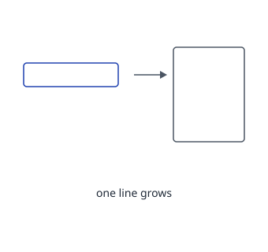
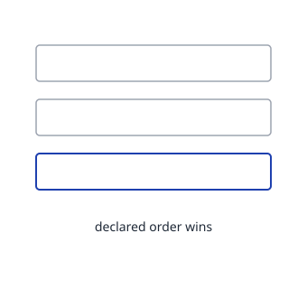

---
# Wiki Pattern Layout Demo
Left column plus a required SVG diagram
---
## Seed Note
<!--pattern-->
### 状況
A thought arrives while doing something else.

### 問題
Waiting for a tidy moment means the note never gets written.

### 解決
Write one sentence. Grow it later.

<!--takeaway-->
Takeaway と図解が同居する形。
---
## Sections Out Of Order
<!--pattern-->
### 解決
Sections are stacked in the order the vocabulary declares them, not the order written.

### 状況
The three sections are written 解決 → 状況 → 問題.

### 問題
Reading order must not depend on authoring order.

