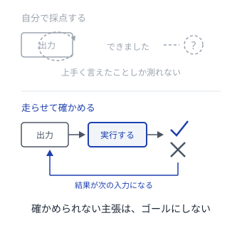
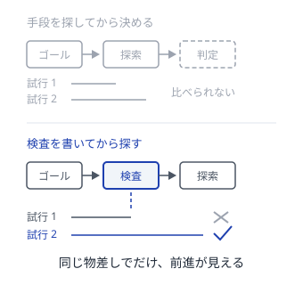
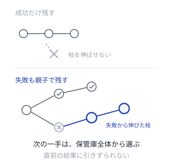
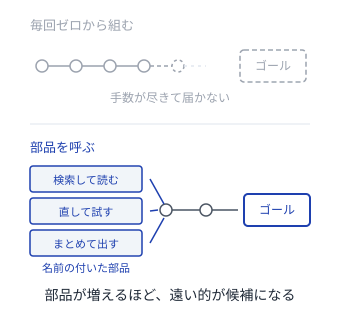

# エージェントがゴールを見つける

ゴールも手段も事後に見つける、自律エージェントのパターン

---

## 組み立て方
<!--id:組み立て方-->
<!--agenda-->
人が渡すのは方向と境界だけ。ゴールは走らせてから決まる

### 立てる: [[ゴールを立てさせる]]
### 確かめる: [[実行が判定する]]
### 判定: [[検査を先に書く]]
### 区切る: [[予算で問い直す]]
### 残す: [[失敗も残す]]
### 選ぶ: [[伸びしろで選ぶ]]
### 貯める: [[できたことを部品に]]
### 対応: [[対応表]]
### 背景: [[intro-agent/委ねる理由|第1部 なぜ委ねるのか]]

---

## ゴールを立てさせる
<!--id:ゴールを立てさせる-->
<!--pattern-->
### 状況
達成してほしいことを、渡す指示文に全部書き切ろうとする。

### 問題
書き切れるゴールなら、エージェントは要らない。
書き切れないゴールを固定すると、状況が変わっても的の外れた探索を続ける。
何を狙うべきかは、その場を見た側にしか分からない。

### 解決
**人は方向と境界だけを渡し、具体的なゴールはエージェントに立てさせる。**
立てたゴールは仮のものとして扱い、変えたときは申告させる。

<!--takeaway-->
関連: [[伸びしろで選ぶ]] / [[patterns-llm-wiki/人が承認する|人が承認する]]

---

## 実行が判定する
<!--id:実行が判定する-->
<!--pattern-->
### 状況
エージェントが自分の出力を自分で評価し、達成したと判断している。

### 問題
自分で自分を採点させると、うまく言い切る力しか測れない。
誤りを達成として通すと、その上に積んだ探索がまるごと無駄になる。
しかも気づくのは、ずっと後になってからである。

### 解決
**達成したかどうかは、実際に走らせた結果で決める。**
走らせて確かめられない主張は、ゴールに使わない。

<!--takeaway-->
関連: [[検査を先に書く]] / [[できたことを部品に]]

---

## 検査を先に書く
<!--id:検査を先に書く-->
<!--pattern-->
### 状況
ゴールが探索の途中で変わるので、合否の基準も一緒に動いている。

### 問題
合否の基準が動くと、どの試行が前進だったのか後から分からない。
記録は残っても、比べられない記録は次の判断に使えない。

### 解決
**ゴールを立てたら、まず検査を書き、それから手段を探す。**
検査はエージェントの外に置き、探索の最中は書き換えさせない。

<!--takeaway-->
関連: [[実行が判定する]] / [[patterns-llm-wiki/規約は走らせる|規約は走らせる]]

---

## 予算で問い直す
<!--id:予算で問い直す-->
<!--pattern-->
### 状況
見込みの無い方向に、エージェントが延々と試行を重ねている。

### 問題
自分で試し続ける仕組みは、自分では止まらない。
止まらないまま回ると、成果ではなく費用だけが積み上がる。
やめる判断を本人の見立てに任せると、いつも「あと一手」になる。

### 解決
**手数と費用の上限を先に決め、尽きたら手段ではなくゴールを立て直す。**
上限に届いたことは失敗の合図ではなく、問い直しの合図として扱う。

<!--takeaway-->
関連: [[ゴールを立てさせる]] / [[伸びしろで選ぶ]]

---

## 失敗も残す
<!--id:失敗も残す-->
<!--pattern-->
### 状況
失敗した試行を捨て、うまくいった経路だけを次に渡している。

### 問題
いまの失敗は、次のゴールから見れば途中の一歩かもしれない。
捨ててしまうと、そこから枝を伸ばす道が消える。
残った経路が一本だと、探索は最後に触った結果に引きずられる。

### 解決
**成否によらず、どこから枝分かれしたかを添えて保管する。**
次の一手は直前の結果からではなく、保管したもの全体から選ぶ。

<!--takeaway-->
関連: [[伸びしろで選ぶ]] / [[patterns-llm-wiki/不変の生データ|不変の生データ]]

---

## 伸びしろで選ぶ
<!--id:伸びしろで選ぶ-->
<!--pattern-->
### 状況
次に狙うゴールを、達成しやすさの見込みで選んでいる。

### 問題
できることばかり選ぶと何も分からず、できないことばかり選ぶと何も進まない。
どちらでも試行が学びに変わらないまま、上限だけが減っていく。

### 解決
**成功率がまだ動いている領域に、試行を寄せる。**
伸びが止まった領域は降ろし、まったく動かない領域は後回しにする。

<!--takeaway-->
関連: [[失敗も残す]] / [[予算で問い直す]]

---

## できたことを部品に
<!--id:できたことを部品に-->
<!--pattern-->
### 状況
一度解けた手順を、次の実行でまたゼロから組み立てている。

### 問題
前回の文脈は、次の実行には残らない。
同じ探索を繰り返すぶんだけ余力が減り、遠くのゴールに届かなくなる。
届かないゴールは、そもそも候補にすら挙がらない。

### 解決
**通った手順を、名前と使い方を添えて保存し、次の探索から呼べるようにする。**
保存してよいのは [[実行が判定する]] を通った手順だけにする。

<!--takeaway-->
関連: [[実行が判定する]]

---

## 対応表
<!--id:対応表-->
<!--table-->

| 共通の力学 | スクラム | エージェント |
| --- | --- | --- |
| ゴールは捨てられる仮説 | 仮のゴール | ゴールを立てさせる |
| 外に出して初めて分かる | 動くものが問う | 実行が判定する |
| 判定はゴールの外に置く | 完成を先に決める | 検査を先に書く |
| 探索は自分では止まらない | 期限で問い直す | 予算で問い直す |
| 外れは次の踏み石 | 外れを棚に残す | 失敗も残す |
| 学びの大きい順に取る | 分からない順に取る | 伸びしろで選ぶ |
| 手段は在庫として貯まる | やり方を型にする | できたことを部品に |

<!--takeaway-->
上の4行がゴールを見つける側、下の3行がその手段を見つける側。対応を見るのはこの1枚だけでよい
