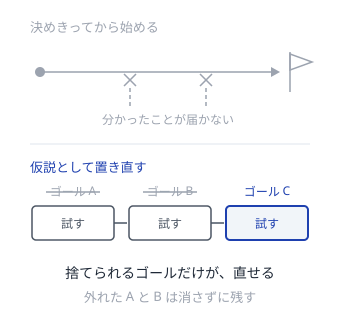
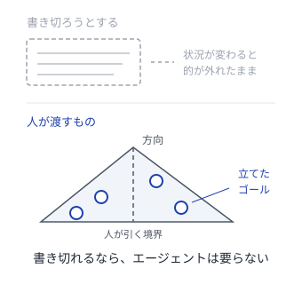
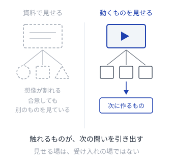
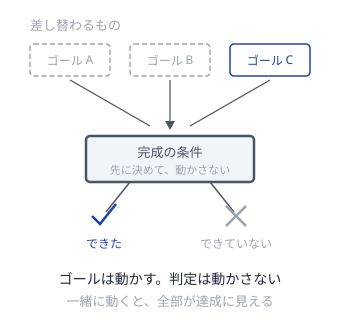
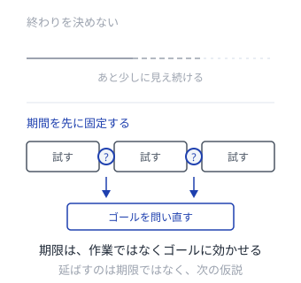
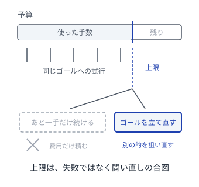
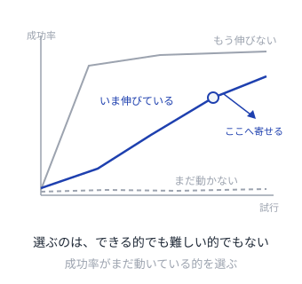

# ゴールは後から決まる

不確実な状況で、ゴールと、その達成手段を事後に探すパターン

---

## 探し方
<!--id:探し方-->
<!--agenda-->
活動ごとに、チームの形とエージェントの形を対で置く

### 立てる: [[仮のゴール]] / [[ゴールを立てさせる]]
### 見せる: [[動くものが問う]] / [[実行が判定する]]
### 判定: [[完成を先に決める]] / [[検査を先に書く]]
### 区切る: [[期限で問い直す]] / [[予算で問い直す]]
### 残す: [[外れを棚に残す]] / [[失敗も残す]]
### 選ぶ: [[分からない順に取る]] / [[伸びしろで選ぶ]]
### 貯める: [[やり方を型にする]] / [[できたことを部品に|部品にする]]
### 一覧: [[対応表]]
### 背景: [[intro-goal-search/探す理由|第1部 なぜ探すのか]]

---

## 仮のゴール
<!--id:仮のゴール-->
<!--pattern-->
### 状況
何を達成すべきかを決めきってから着手しようとする。

### 問題
決めきるだけの情報は、着手前には無い。
一度決めたゴールは、外れていても区切りの終わりまで残る。
途中で分かったことが、ゴールに戻らない。

### 解決
**ゴールを、期限付きの仮説として置く。**
「これができれば何が確かめられるか」を一文で書き、外れたら捨てる前提にする。
捨てた記録は [[外れを棚に残す]]。

<!--takeaway-->
対: [[ゴールを立てさせる]] / 関連: [[期限で問い直す]] / [[完成を先に決める]]

---

## ゴールを立てさせる
<!--id:ゴールを立てさせる-->
<!--pattern-->
### 状況
探索そのものをエージェントに任せるとき、
達成してほしいことを、渡す指示文に全部書き切ろうとする。

### 問題
書き切れるゴールなら、エージェントは要らない。
書き切れないゴールを固定すると、状況が変わっても的の外れた探索を続ける。
何を狙うべきかは、その場を見た側にしか分からない。

### 解決
**人は方向と境界だけを渡し、具体的なゴールはエージェントに立てさせる。**
立てたゴールは [[仮のゴール]] として扱い、変えたときは申告させる。

<!--takeaway-->
対: [[仮のゴール]] / 関連: [[伸びしろで選ぶ]] / [[patterns-llm-wiki/人が承認する|人が承認する]]

---

## 動くものが問う
<!--id:動くものが問う-->
<!--pattern-->
### 状況
何を作るべきかを、資料と会議で議論している。

### 問題
資料の空白は、読み手が想像で埋める。
埋め方は人ごとに違うので、合意しても全員が同じものを指していない。
本当の要望は、触れるものが出るまで言葉にならない。

### 解決
**毎回、触れるものを外に出す。**
見せる場を受け入れの場ではなく、次のゴールを見つける場として使う。
出てきた要望は、そのまま次の [[仮のゴール]] の材料になる。

<!--takeaway-->
対: [[実行が判定する]] / 関連: [[仮のゴール]] / [[分からない順に取る]]

---

## 実行が判定する
<!--id:実行が判定する-->
<!--pattern-->
### 状況
探索を任せたエージェントが、自分の出力を自分で評価し、達成したと判断している。

### 問題
自分で自分を採点させると、うまく言い切る力しか測れない。
誤りを達成として通すと、その上に積んだ探索がまるごと無駄になる。
しかも気づくのは、ずっと後になってからである。

### 解決
**達成したかどうかは、実際に走らせた結果で決める。**
[[動くものが問う]] と同じで、外に出して初めて分かる。
走らせて確かめられない主張は、ゴールに使わない。

<!--takeaway-->
対: [[動くものが問う]] / 関連: [[検査を先に書く]] / [[できたことを部品に]]

---

## 完成を先に決める
<!--id:完成を先に決める-->
<!--pattern-->
### 状況
ゴールが動くので、何をもって「できた」とするかも毎回揺れている。

### 問題
判定がゴールと一緒に動くと、どんな結果も達成に見えてしまう。
うまくいったのか分からない試行は、次の材料にならない。

### 解決
**完成の条件を、ゴールとは別に、先に決めて外に置く。**
ゴールは毎回差し替えてよい。差し替えないのは判定のほうにする。

<!--takeaway-->
対: [[検査を先に書く]] / 関連: [[動くものが問う]] / [[仮のゴール]]

---

## 検査を先に書く
<!--id:検査を先に書く-->
<!--pattern-->
### 状況
任せた探索の途中でゴールが変わるので、合否の基準も一緒に動いている。

### 問題
合否の基準が動くと、どの試行が前進だったのか後から分からない。
記録は残っても、比べられない記録は次の判断に使えない。

### 解決
**ゴールを立てたら、まず検査を書き、それから手段を探す。**
[[完成を先に決める]] を、機械が合否を出せる形にしたものである。
検査はエージェントの外に置き、探索の最中は書き換えさせない。

<!--takeaway-->
対: [[完成を先に決める]] / 関連: [[実行が判定する]] / [[patterns-llm-wiki/規約は走らせる|規約は走らせる]]

---

## 期限で問い直す
<!--id:期限で問い直す-->
<!--pattern-->
### 状況
見込みが外れていても、あと少しで終わりそうに見えて続けてしまう。

### 問題
ゴールを探す作業には、自然な終わりが無い。
終わりが無いものは、成果ではなく消耗で終わる。
やめる判断を各自の見切りに任せると、誰もやめない。

### 解決
**期間を先に固定し、期限では作業ではなくゴールを問い直す。**
区切りの単位は時間で、使い切ったかどうかは誰の目にも同じに見える。
延ばすのは期限ではなく、次に置く仮説のほう。

<!--takeaway-->
対: [[予算で問い直す]] / 関連: [[仮のゴール]] / [[分からない順に取る]]

---

## 予算で問い直す
<!--id:予算で問い直す-->
<!--pattern-->
### 状況
任せた探索が、見込みの無い方向に延々と試行を重ねている。

### 問題
自分で試し続ける仕組みは、自分では止まらない。
止まらないまま回ると、成果ではなく費用だけが積み上がる。
やめる判断を本人の見立てに任せると、いつも「あと一手」になる。

### 解決
**手数と金額の上限を先に決め、尽きたら手段ではなくゴールを立て直す。**
区切るのは時間ではなく費用である。待っていても減らないぶん、
上限を先に置かないと際限が無い。上限は失敗の合図ではなく問い直しの合図。

<!--takeaway-->
対: [[期限で問い直す]] / 関連: [[ゴールを立てさせる]] / [[伸びしろで選ぶ]]

---

## 外れを棚に残す
<!--id:外れを棚に残す-->
<!--pattern-->
### 状況
採らなかった案や、うまくいかなかった試みを、その場で捨てている。

### 問題
外れた理由は、次にゴールが変わったとき効いてくる。
消してしまうと、同じ道を同じ人がもう一度歩く。
拾い直せないと、ゴールを大胆に捨てる判断もできなくなる。

### 解決
**やめた案とやめた理由を、順番の付いた棚に残す。**
棚から拾い直せることが、ゴールを捨てられる条件になる。

<!--takeaway-->
対: [[失敗も残す]] / 関連: [[仮のゴール]] / [[patterns-llm-wiki/追記で残す|追記で残す]]

---

## 失敗も残す
<!--id:失敗も残す-->
<!--pattern-->
### 状況
任せた探索で失敗した試行を捨て、うまくいった経路だけを次に渡している。

### 問題
いまの失敗は、次のゴールから見れば途中の一歩かもしれない。
捨ててしまうと、そこから枝を伸ばす道が消える。
残った経路が一本だと、探索は最後に触った結果に引きずられる。

### 解決
**成否によらず、どこから枝分かれしたかを添えて保管する。**
[[外れを棚に残す]] との違いは、残すのが理由ではなく分岐点であること。
次の一手は直前の結果からではなく、保管したもの全体から選ぶ。

<!--takeaway-->
対: [[外れを棚に残す]] / 関連: [[伸びしろで選ぶ]] / [[patterns-llm-wiki/不変の生データ|不変の生データ]]

---

## 分からない順に取る
<!--id:分からない順に取る-->
<!--pattern-->
### 状況
次にやることを、価値の見積もりが大きい順に並べている。

### 問題
ゴールがまだ仮説なら、その価値の見積もりも仮説の上に乗っている。
結果が読めている項目をいくら片づけても、読めていた分しか分からない。
ゴールは動かないまま、作業だけが進んでいく。

### 解決
**結果がどちらに転んでも次の判断が変わる項目から取る。**
確実にできる項目は、分からない項目の後ろに置く。

<!--takeaway-->
対: [[伸びしろで選ぶ]] / 関連: [[動くものが問う]] / [[期限で問い直す]]

---

## 伸びしろで選ぶ
<!--id:伸びしろで選ぶ-->
<!--pattern-->
### 状況
任せた探索の次のゴールを、達成しやすさの見込みで選んでいる。

### 問題
できることばかり選ぶと何も分からず、できないことばかり選ぶと何も進まない。
どちらでも試行が学びに変わらないまま、上限だけが減っていく。

### 解決
**成功率がまだ動いている領域に、試行を寄せる。**
[[分からない順に取る]] を、成功率の変化で測れる形にしたものである。
伸びが止まった領域は降ろし、まったく動かない領域は後回しにする。

<!--takeaway-->
対: [[分からない順に取る]] / 関連: [[失敗も残す]] / [[予算で問い直す]]

---

## やり方を型にする
<!--id:やり方を型にする-->
<!--pattern-->
### 状況
うまくいったやり方が、その回の記憶として個人に残っている。

### 問題
ゴールが変わるたびに、手段を毎回ゼロから組み直すことになる。
試行錯誤の速さは、手元にある手段の数で決まる。
在庫が増えないチームは、いつまでも同じ距離しか進めない。

### 解決
**通ったやり方に名前を付け、誰でも呼べる形にして残す。**
振り返りの成果物を感想ではなく、次から使える手順にする。

<!--takeaway-->
対: [[できたことを部品に]] / 関連: [[分からない順に取る]]

---

## できたことを部品に
<!--id:できたことを部品に-->
<!--pattern-->
### 状況
一度解けた手順を、任せた次の実行でまたゼロから組み立てている。

### 問題
前回の文脈は、次の実行には残らない。
同じ探索を繰り返すぶんだけ余力が減り、遠くのゴールに届かなくなる。
届かないゴールは、そもそも候補にすら挙がらない。

### 解決
**通った手順を、名前と使い方を添えて保存し、次の探索から呼べるようにする。**
人が読む [[やり方を型にする]] に対し、こちらは呼び出せる形で置く。
保存してよいのは [[実行が判定する]] を通った手順だけにする。

<!--takeaway-->
対: [[やり方を型にする]] / 関連: [[実行が判定する]]

---

## 対応表
<!--id:対応表-->
<!--table-->

| 共通の力学 | チームで回す | エージェントに任せる |
| --- | --- | --- |
| ゴールは捨てられる仮説 | 仮のゴール | ゴールを立てさせる |
| 外に出して初めて分かる | 動くものが問う | 実行が判定する |
| 判定はゴールの外に置く | 完成を先に決める | 検査を先に書く |
| 探索は自分では止まらない | 期限で問い直す（時間） | 予算で問い直す（金額） |
| 外れは次の踏み石 | 外れを棚に残す | 失敗も残す |
| 学びの大きい順に取る | 分からない順に取る | 伸びしろで選ぶ |
| 手段は在庫として貯まる | やり方を型にする | できたことを部品に |

<!--takeaway-->
上の4行がゴールを見つける側、下の3行がその手段を見つける側。区分の軸は主体ではなく活動
