# LLM が手入れする Wiki

AI が保守者として入ってくる Wiki のパターン

---

## LLM Wiki
<!--id:LLM-Wiki-->
<!--agenda-->
人は観察と判断を入れ、AI は規約に従って整える

### 夜: [[夜間の手入れ]]
### 役割: [[AIは保守者]]
### 素材: [[不変の生データ]]
### 履歴: [[追記で残す]]
### 承認: [[人が承認する]]
### 根拠: [[出典まで辿れる]]
### 実務: [[日々の実務]]
### 戻る: [[patterns-wiki/読み方|読み方]]
### 背景: [[intro-llm-wiki/任せる理由|第1部 なぜ任せるのか]]

---

## 夜間の手入れ
<!--id:夜間の手入れ-->
<!--pattern-->
### 状況
日中は素材が溜まる一方で、整える時間が取れない。

### 問題
整えない Wiki は、ただの物置になる。だが整える作業は退屈で、
いつも「あとで」に回される。結局、人の空き時間のぶんしか進まない。

### 解決
**AI を定時に走らせる。** その日の素材を取り込み、
[[つなぎ直し]] を実行し、[[索引は後から]] を作り直す。
人は朝、整った状態から読み始める。

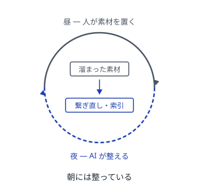

<!--takeaway-->
関連: [[AIは保守者]] / [[人が承認する]] / [[差分だけ渡す]]

---

## AIは保守者
<!--id:AIは保守者-->
<!--pattern-->
### 状況
AI に全部書かせたくなる。実際それらしい文章は出てくる。

### 問題
何を見たか、どれが正しいかは、人にしか決められない。AI に著者をやらせると、
それらしいが中身の無いノートが増え、本物と見分けがつかなくなる。

### 解決
**役割を分ける。** 人が観察と判断を入れ、AI は規約に従って
整形・接続・検出だけを担う。AI は著者ではなく司書。

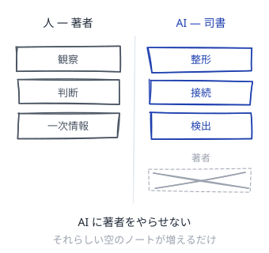

<!--takeaway-->
関連: [[人が承認する]] / [[夜間の手入れ]] / [[書き手を残す]]

---

## 不変の生データ
<!--id:不変の生データ-->
<!--pattern-->
### 状況
AI が整えるうちに、元になった記録まで書き換わっていく。

### 問題
元の記録が失われると、後から確かめ直せない。
AI の要約が、いつのまにか事実として通用しはじめる。

### 解決
**取ってきたままの記録・人が書く Wiki・形式の決まりの3つに分ける。**
記録の層は足すだけにして、直しも削除もしない。
AI が書き換えてよいのは Wiki の層だけ。

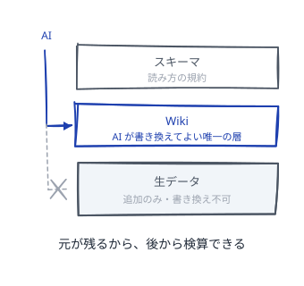

<!--takeaway-->
関連: [[出典まで辿れる]] / [[追記で残す]]

---

## 追記で残す
<!--id:追記で残す-->
<!--pattern-->
### 状況
判断が変わるたびに、前の記述を上書きしてしまう。

### 問題
上書きすると「なぜそう考えたか」が消える。
AI は指示すれば平気で上書きするので、放っておくと履歴が痩せる。

### 解決
**出来事を起きた順に足し、いまの状態はそこから組み立て直す。**
消すのではなく、変わったと書き足す。[[剪定]] が効くのはこの上でだけ。

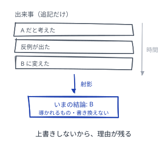

<!--takeaway-->
関連: [[不変の生データ]] / [[剪定]] / [[生成物は直さない]]

---

## 人が承認する
<!--id:人が承認する-->
<!--pattern-->
### 状況
AI が自動で判断を書き換え、いつのまにか結論が変わっている。

### 問題
気づかない変更は、間違っていても見つからない。
速く自動で回るぶん、誤りも速く広がっていく。

### 解決
**解釈を伴う変更は提案で止め、人の承認を経てから反映する。**
機械的に決まることだけ自動で通す。境界を先に決めておく。

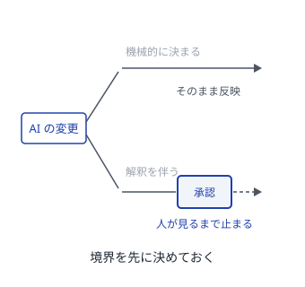

<!--takeaway-->
関連: [[AIは保守者]] / [[夜間の手入れ]] / [[語彙を寄せる]]

---

## 出典まで辿れる
<!--id:出典まで辿れる-->
<!--pattern-->
### 状況
Wiki の主張が、どの記録に基づくのか分からなくなる。

### 問題
根拠の書いていない主張は、人が書いたのか AI が書いたのかも分からない。
分からないものは、信じることも疑うこともできない。

### 解決
**主張から元の資料まで、リンクの鎖を切らさない。**
鎖が切れている箇所は、AI が検出して報告する。

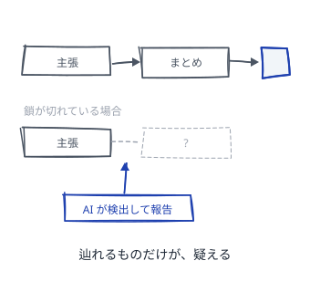

<!--takeaway-->
関連: [[不変の生データ]] / [[つなぎ直し]] / [[収穫]]

---

## 日々の実務
<!--id:日々の実務-->
<!--agenda-->
役割と境界を決めたあと、毎日の手入れで効いてくること

### 語彙: [[語彙を寄せる]]
### 検査: [[規約は走らせる]]
### 導出: [[生成物は直さない]]
### 未解決: [[問いを置く]]
### 分量: [[差分だけ渡す]]
### 署名: [[書き手を残す]]
### 戻る: [[LLM-Wiki|原則]]

---

## 語彙を寄せる
<!--id:語彙を寄せる-->
<!--pattern-->
### 状況
同じものを指す言葉が、ノートごとに少しずつ違う。

### 問題
人は前後から読み替えられるが、その読み替えはどこにも残らない。
言い方が割れると、検索もリンクも当たらなくなる。

### 解決
**正しい言い方を1つ決め、他の言い方はそこへ向ける。**
決めるのは人、寄せるのは AI。語彙表は残す。
変えるときは [[人が承認する]] を通す。

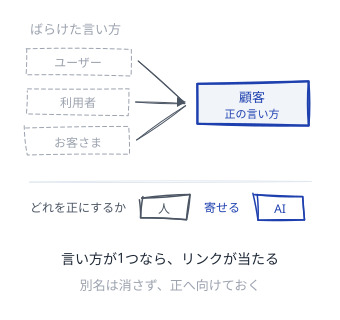

<!--takeaway-->
関連: [[規約は走らせる]] / [[つなぎ直し]]

---

## 規約は走らせる
<!--id:規約は走らせる-->
<!--pattern-->
### 状況
決まりを文書にしたが、守られたか誰も確かめない。

### 問題
読ませるだけの決まりは破られ、破れたと気づくのは後になる。
AI も、前の会話で伝えた決まりを次の会話では覚えていない。

### 解決
**規約を検査として書き、毎回走らせる。**
文章は入口の説明にとどめ、合否の判定はプログラムに置く。
落ちた検査は、そのまま [[問いを置く]] の材料。

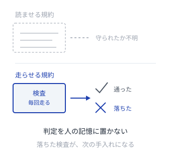

<!--takeaway-->
関連: [[AIは保守者]] / [[語彙を寄せる]]

---

## 生成物は直さない
<!--id:生成物は直さない-->
<!--pattern-->
### 状況
AI が作った索引や要約に誤りを見つけ、その場で直したくなる。

### 問題
直した先は次の生成で消える。消えたことに気づかないまま、
同じ誤りを何度も直し続ける。直した労力だけが記録に残らない。

### 解決
**導出されたものは直さず、導いた側を直す。**
索引が変なら [[索引は後から]] の作り方を直す。
要約が変なら元のノートを直す。自動で作ったページには、その旨を書き添える。

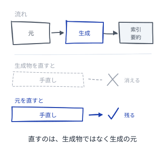

<!--takeaway-->
関連: [[索引は後から]] / [[追記で残す]]

---

## 問いを置く
<!--id:問いを置く-->
<!--pattern-->
### 状況
分からないことを、答えが出るまで書かないでいる。

### 問題
頭の中にある問いは、他人にも AI にも見えない。
見えない作業は、誰にも引き取れないまま忘れられる。

### 解決
**問いを問いのまま1枚にする。**
答えの無いノートがあってよい。AI には答えさせず、
材料を集めて繋ぐことだけ任せる。答えが出たら [[追記で残す]]。

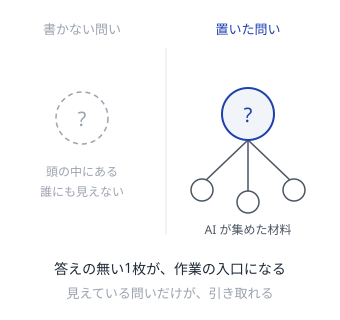

<!--takeaway-->
関連: [[規約は走らせる]] / [[出典まで辿れる]]

---

## 差分だけ渡す
<!--id:差分だけ渡す-->
<!--pattern-->
### 状況
手入れのたびに、Wiki 全体を AI に読ませている。

### 問題
渡す量が増えるほど費用は上がり、AI の注意も散る。
見落としが増えて初めて、渡しすぎだったと気づくことになる。

### 解決
**変わったところと、その周りだけを渡す。**
何が変わったかは履歴が知っている。
全体を見るのは [[索引は後から]] を作り直すときだけ。

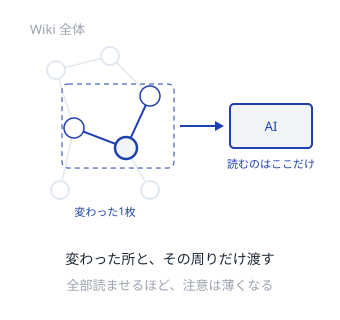

<!--takeaway-->
関連: [[夜間の手入れ]] / [[一枚一義]]

---

## 書き手を残す
<!--id:書き手を残す-->
<!--pattern-->
### 状況
ノートの一行が、人の判断なのか AI の整形なのか分からない。

### 問題
疑うべき場所が分からないと、全部を等しく疑うことになる。
等しく疑われる Wiki は、結局どこも読まれない。

### 解決
**書いた主体を行に残す。** 人の判断には手を触れない。
AI が足したぶんは、後から一括で剥がせるようにする。
何に基づくかは [[出典まで辿れる]] が受け持つ。

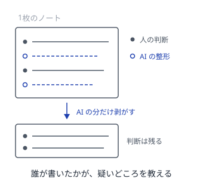

<!--takeaway-->
関連: [[AIは保守者]] / [[剪定]]
