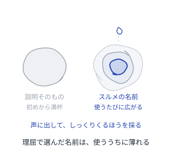
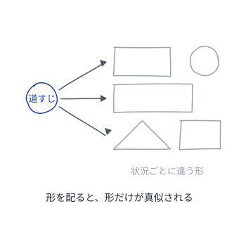
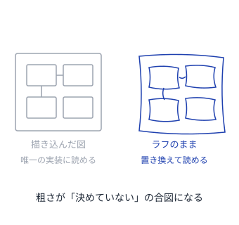
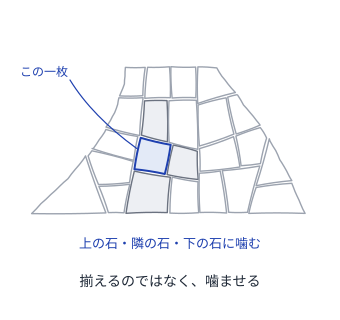

# パターンを書くパターン

良いパターンの質そのものを、パターンにする

---

## 読み方
<!--id:読み方-->
<!--agenda-->
名前・振る舞い・繋がり・書き上げ方の4つに分けて引く

### 呼ぶ: [[名前]]
### 効かせる: [[振る舞い]]
### 繋ぐ: [[繋がり]]
### 仕上げる: [[仕上げ]]
### 隣: [[patterns-wiki/読み方|Wiki が育つパターン]]

---

## 名前
<!--id:名前-->
<!--agenda-->
名前が会話に載らないかぎり、そのパターンは誰にも使われない

### 効き: [[スルメの名前]]
### 比喩: [[借りてきた比喩]]
### 検算: [[声に出して読む]]
### 次: [[振る舞い]]
### 目次: [[読み方]]

---

## 振る舞い
<!--id:振る舞い-->
<!--agenda-->
枠が埋まっていても、まだパターンとは限らない

### 力: [[緊張感のある状況]]
### 生む: [[釣り竿を渡す]]
### 図: [[ラフで出す]]
### 証拠: [[3ストライクで書く]]
### 次: [[繋がり]]
### 目次: [[読み方]]

---

## 繋がり
<!--id:繋がり-->
<!--agenda-->
一枚ずつ正しくても、繋がっていなければカタログで終わる

### 繋ぐ: [[でこぼこ石畳]]
### 導く: [[文に溶かす]]
### 次: [[仕上げ]]
### 目次: [[読み方]]

---

## 仕上げ
<!--id:仕上げ-->
<!--agenda-->
質は書き手の腕前ではなく、書き上げ方から出てくる

### 合評: [[黙って聴く著者]]
### 検算: [[声に出して読む]]
### 戻る: [[読み方]]
### 隣: [[patterns-llm-wiki/LLM-Wiki|LLM Wiki]]

---

## スルメの名前
<!--id:スルメの名前-->
<!--pattern-->
### いつ・なにが困るか
名前を、意味が合うか、一度で伝わるかで選ぶ。
説明せずに通じる名前が、いちばん親切に思える。

**一度で伝わる名前は、たいてい説明である。**
説明は読んだ時点で満杯で、使っても増えない。
増えない名前は会話に載らず、やがて忘れられる。

### そこで
**一発で伝わらなくてよい。噛むほど味が出る。**
理屈で選ぶと薄れる。[[声に出して読む]] と濃くなる。
説明は本文と [[借りてきた比喩]] が引き受ける。

---

## 借りてきた比喩
<!--id:借りてきた比喩-->
<!--pattern-->
### いつ・なにが困るか
新しい概念なので、新しい言葉を作りたくなる。
既存の語に [[patterns-llm-wiki/語彙を寄せる|寄せる]] と、誤解されそうに思える。

**新語は、覚える手間を読者に押し付ける。**
払ってもらえない名前は、読むまで分からない。
正確さと引き換えに、その名前は会話に載らない。

### そこで
**すでに全員が知っている比喩を借りる。**
借り物なら手間はゼロ。[[スルメの名前]] になる。
要らない意味も運ぶので、本文の最初で打ち消す。

---

## 声に出して読む
<!--id:声に出して読む-->
<!--pattern-->
### いつ・なにが困るか
[[黙って聴く著者]] の場に出す前に、一人で決める。
黙って読むぶんには通るので、それで決めてしまう。

**良い名前かどうかは、会話で初めて分かる。**
声に出して詰まる名前も、黙読では詰まらない。
分かった頃には他所から張られ、改名すると折れる。

### そこで
**書いた直後に、同僚に向けて声に出す。**
詰まったら即、改名する。値段は繋がった数で上がる。
[[スルメの名前]] は、声でしか確かめられない。

---

## 緊張感のある状況
<!--id:緊張感のある状況-->
<!--pattern-->
### いつ・なにが困るか
場面と打ち手を書いたので、書けた気になっている。
[[3ストライクで書く]] 前に、枠だけ埋めてしまう。

**緊張の無い状況は、ただの手順書である。**
読み手は、いつ使ってよいかを判断できない。
できるのは、そのまま真似ることだけになる。

### そこで
**解に反対する力も書く。**
諦めるものまで書けば、[[釣り竿を渡す]] ことになる。
反対の力が書けないなら、それはパターンではない。

---

## 釣り竿を渡す
<!--id:釣り竿を渡す-->
<!--pattern-->
### いつ・なにが困るか
釣った魚を見せるのが、親切だと思っている。
[[緊張感のある状況]] を伏せ、効いた形だけ渡す。

**完成形を見せると、その形だけが真似される。**
状況が違っても、同じ形がそのまま置かれる。
効かなかったとき、直す手がかりが残っていない。

### そこで
**魚ではなく、釣り方を渡す。**
効いた形ではなく、形が生まれる道すじを書く。
自分の状況で、違う形を釣る。図は [[ラフで出す]]。

---

## ラフで出す
<!--id:ラフで出す-->
<!--pattern-->
### いつ・なにが困るか
パターンに添える図を、きれいに描き上げたくなる。
粗いと手を抜いたように見えるので、描き込みたい。

**整った図は「これが唯一の実装」と読まれる。**
描き込むほど、自分の状況に置き換える余地が減る。
本文が [[釣り竿を渡す]] と書いても、図が強く残る。

### そこで
**図はラフのまま出す。示唆にとどめる。**
[[緊張感のある状況]] が見えれば、それでよい。
粗さが「ここは決めていない」の合図になる。

---

## 3ストライクで書く
<!--id:3ストライクで書く-->
<!--pattern-->
### いつ・なにが困るか
一度うまくいったやり方を、すぐ書きたくなる。
実感があるうちに書かないと、忘れそうに思える。

**一度きりの成功は、偶然と区別がつかない。**
パターンは発明ではなく発見である。
早く書いたぶん、外れたときに剥がす手間が増える。

### そこで
**別々の場面で3度目に出会うまで書かない。**
3度で [[緊張感のある状況]] が見え、構造が残る。
それまでは [[patterns-wiki/種ノート|種ノート]] に置く。

---

## でこぼこ石畳
<!--id:でこぼこ石畳-->
<!--pattern-->
### いつ・なにが困るか
1つずつ完成させ、[[patterns-wiki/つなぎ直し|つなぎ直し]] を後回しにする。
一枚ずつ正しいので、揃えば言語になると思う。

**孤立したパターンの集まりは、言語ではない。**
読み手は、次にどれを読めばよいか分からない。
分からないまま止まり、残りは開かれない。

### そこで
**上位・同位・下位の3方向へ噛ませる。**
繋ぎ方は [[文に溶かす]]。大きさは揃わなくてよい。
不揃いのまま噛み合ったとき、集まりは言語になる。

---

## 文に溶かす
<!--id:文に溶かす-->
<!--pattern-->
### いつ・なにが困るか
関連パターンを、末尾の「関連」欄にまとめている。
一箇所に集まっていたほうが、整って見える。

**末尾の欄は読み飛ばされる。**
読み終えた読み手は、もう次のページを見ている。
辿られないリンクは、[[patterns-wiki/収穫|収穫]] されない。

### そこで
**関連は、本文の文の中に溶かして書く。**
「ここで [[でこぼこ石畳]] が効く」と書けば目に入る。
それが [[スルメの名前]] なら、辿らずとも通る。

---

## 黙って聴く著者
<!--id:黙って聴く著者-->
<!--pattern-->
### いつ・なにが困るか
[[3ストライクで書く]] を経た原稿を、場に出す。
読者が [[声に出して読む]] と、誤読を解きたくなる。

**著者が説明を始めると、読者は遠慮する。**
書いた本人を前に「分からない」とは言いにくい。
そして本当に詰まった場所を言わないまま帰る。

### そこで
**著者は黙り、読者だけで議論する。**
読者が迷った場所こそ、次の読者も迷う場所である。
説明しないと伝わらなかった箇所が、直すべき箇所。

---
