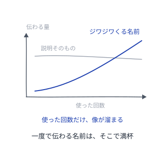

# パターンを書くパターン

良いパターンの質そのものを、パターンにする

---

## 読み方
<!--id:読み方-->
<!--agenda-->
名前・振る舞い・繋がり・書き上げ方の4つに分けて引く

### 呼ぶ: [[名前]]
### 効かせる: [[振る舞い]]
### 繋ぐ: [[繋がり]]
### 仕上げる: [[仕上げ]]
### 隣: [[patterns-wiki/読み方|Wiki が育つパターン]]

---

## 名前
<!--id:名前-->
<!--agenda-->
名前が会話に載らないかぎり、そのパターンは誰にも使われない

### 効き: [[ジワジワくる名前]]
### 比喩: [[借りてきた比喩]]
### 検算: [[口に出して試す]]
### 次: [[振る舞い]]
### 目次: [[読み方]]

---

## 振る舞い
<!--id:振る舞い-->
<!--agenda-->
枠が埋まっていても、まだパターンとは限らない

### 力: [[引き裂かれた状況]]
### 生む: [[解でなく生成]]
### 図: [[図は下書きのまま]]
### 証拠: [[3ストライクで書く]]
### 次: [[繋がり]]
### 目次: [[読み方]]

---

## 繋がり
<!--id:繋がり-->
<!--agenda-->
一枚ずつ正しくても、繋がっていなければカタログで終わる

### 繋ぐ: [[でこぼこ石畳]]
### 溶かす: [[本文の中のリンク]]
### 次: [[仕上げ]]
### 目次: [[読み方]]

---

## 仕上げ
<!--id:仕上げ-->
<!--agenda-->
質は書き手の腕前ではなく、書き上げ方から出てくる

### 合評: [[黙って聴く著者]]
### 検算: [[口に出して試す]]
### 戻る: [[読み方]]
### 隣: [[patterns-llm-wiki/LLM-Wiki|LLM Wiki]]

---

## ジワジワくる名前
<!--id:ジワジワくる名前-->
<!--pattern-->
### いつ・なにが困るか
名前を、意味が合うか、一度で伝わるかで選ぶ。
説明せずに通じる名前が、いちばん親切に思える。

**一度で伝わる名前は、たいてい説明である。**
説明は読んだ時点で満杯で、使っても増えない。
増えない名前は会話に載らず、やがて忘れられる。

### そこで
**一発で伝わらなくてよい。口にして選ぶ。**
理屈で選ぶと薄れ、手応えのある名前は濃くなる。
説明は本文が引き受ける。

<!--takeaway-->
関連: [[借りてきた比喩]] / [[口に出して試す]]

---

## 借りてきた比喩
<!--id:借りてきた比喩-->
<!--pattern-->
### いつ・なにが困るか
新しい概念なので、新しい言葉を作りたくなる。
既存の語では誤解されそうに思える。

**新語は、覚える手間を読者に押し付ける。**
払ってもらえない名前は、読むまで分からない。
正確さと引き換えに、その名前は会話に載らない。

### そこで
**すでに全員が知っている比喩を借りる。**
借り物なら覚える手間はゼロで、見当がつく。
要らない意味も運ぶので、本文の最初で打ち消す。

<!--takeaway-->
関連: [[ジワジワくる名前]] / [[patterns-llm-wiki/語彙を寄せる|語彙を寄せる]]

---

## 口に出して試す
<!--id:口に出して試す-->
<!--pattern-->
### いつ・なにが困るか
名前を、机の上で一人で決めている。
黙って読むぶんには通るので、それで決めてしまう。

**良い名前かどうかは、会話で初めて分かる。**
口に出して詰まる名前も、黙読では詰まらない。
分かった頃には他所から張られ、改名すると折れる。

### そこで
**書いた直後に、同僚との会話で使ってみる。**
詰まったらその場で改名する。まだ誰も見ていない。
改名の値段は、繋がった数だけ上がる。

<!--takeaway-->
関連: [[ジワジワくる名前]] / [[黙って聴く著者]]

---

## 引き裂かれた状況
<!--id:引き裂かれた状況-->
<!--pattern-->
### いつ・なにが困るか
場面と打ち手を書いたので、書けた気になっている。
枠が埋まっているぶん、足りないものは見えない。

**力が書かれていないものは、ただの手順書である。**
読み手は、いつ使ってよいかを判断できない。
できるのは、そのまま真似ることだけになる。

### そこで
**解に反対する力も書く。**
何を諦めれば打ち手が成り立つのかまで書く。
反対の力が書けないなら、それはパターンではない。

<!--takeaway-->
関連: [[解でなく生成]] / [[3ストライクで書く]]

---

## 解でなく生成
<!--id:解でなく生成-->
<!--pattern-->
### いつ・なにが困るか
できあがった形を見せるのが、親切だと思っている。
現に効いた形なので、渡せば効くはずだと思う。

**完成形を見せると、その形だけが真似される。**
状況が違っても、同じ形がそのまま置かれる。
効かなかったとき、直す手がかりが残っていない。

### そこで
**形ではなく、その形が生まれる道すじを書く。**
読み手が自分の状況に当てて、少し違う形を導ける。
構造それ自体は解ではなく、解を生む種である。

<!--takeaway-->
関連: [[引き裂かれた状況]] / [[図は下書きのまま]]

---

## 図は下書きのまま
<!--id:図は下書きのまま-->
<!--pattern-->
### いつ・なにが困るか
パターンに添える図を、きれいに描き上げたくなる。
粗いと手を抜いたように見えるので、描き込みたい。

**整った図は「これが唯一の実装」と読まれる。**
描き込むほど、自分の状況に置き換える余地が減る。
本文が道すじと書いても、図のほうが強く残る。

### そこで
**図は示唆にとどめる。**
どこが要点で、どこが自由なのかだけ分かればよい。
粗さが「ここは決めていない」の合図になる。

<!--takeaway-->
関連: [[解でなく生成]] / [[引き裂かれた状況]]

---

## 3ストライクで書く
<!--id:3ストライクで書く-->
<!--pattern-->
### いつ・なにが困るか
一度うまくいったやり方を、すぐ書きたくなる。
実感があるうちに書かないと、忘れそうに思える。

**一度きりの成功は、偶然と区別がつかない。**
パターンは発明ではなく発見である。
早く書いたぶん、外れたときに剥がす手間が増える。

### そこで
**別々の場面で3度目に出会うまで書かない。**
3度出会えば、効いたのは構造のほうだと言える。
それまでは [[patterns-wiki/種ノート|種ノート]] に置く。

<!--takeaway-->
関連: [[patterns-wiki/種ノート|種ノート]] / [[引き裂かれた状況]]

---

## でこぼこ石畳
<!--id:でこぼこ石畳-->
<!--pattern-->
### いつ・なにが困るか
パターンを1つずつ完成させて、並べている。
一枚ずつ正しいので、揃えば言語になると思う。

**孤立したパターンの集まりは、言語ではない。**
読み手は、次にどれを読めばよいか分からない。
分からないまま止まり、残りは開かれない。

### そこで
**上位・同位・下位の3方向へ噛ませる。**
大きさは揃えなくてよい。噛み合う面があればよい。
不揃いのまま噛み合ったとき、集まりは言語になる。

<!--takeaway-->
関連: [[本文の中のリンク]] / [[patterns-wiki/つなぎ直し|つなぎ直し]]

---

## 本文の中のリンク
<!--id:本文の中のリンク-->
<!--pattern-->
### いつ・なにが困るか
関連パターンを、末尾の「関連」欄にまとめている。
一箇所に集まっていたほうが、整って見える。

**末尾の欄は読み飛ばされる。**
読み終えた読み手は、もう次のページを見ている。
読み飛ばされたリンクは、繋がっていないのと同じ。

### そこで
**参照を本文の文の中に溶かす。**
「ここで [[でこぼこ石畳]] が効く」と書けば目に入る。
名前が [[ジワジワくる名前]] なら、辿らずとも通る。

<!--takeaway-->
関連: [[でこぼこ石畳]] / [[patterns-wiki/収穫|収穫]]

---

## 黙って聴く著者
<!--id:黙って聴く著者-->
<!--pattern-->
### いつ・なにが困るか
書いたパターンに意見をもらう場を作った。
誤読はその場で解いたほうが、早いように思える。

**著者が説明を始めると、読者は遠慮する。**
書いた本人を前に「分からない」とは言いにくい。
そして本当に詰まった場所を言わないまま帰る。

### そこで
**著者は黙り、読者だけで議論する。**
読者が迷った場所こそ、次の読者も迷う場所である。
説明しないと伝わらなかった箇所が、直すべき箇所。

<!--takeaway-->
関連: [[口に出して試す]] / [[3ストライクで書く]]

---
