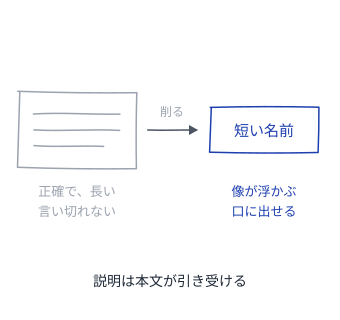
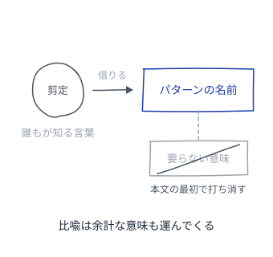
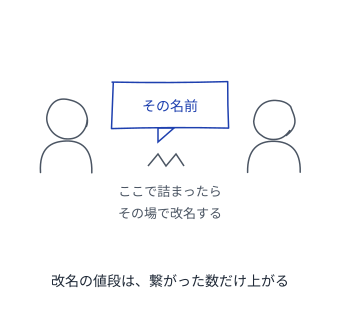
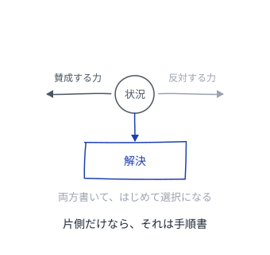
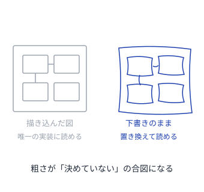
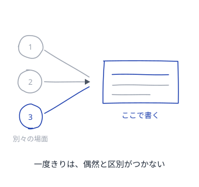

# パターンを書くパターン

良いパターンの質そのものを、パターンにする

---

## 読み方
<!--id:読み方-->
<!--agenda-->
名前・振る舞い・繋がり・書き上げ方の4つに分けて引く

### 呼ぶ: [[名前]]
### 効かせる: [[振る舞い]]
### 繋ぐ: [[繋がり]]
### 仕上げる: [[仕上げ]]
### 隣: [[patterns-wiki/読み方|Wiki が育つパターン]]

---

## 名前
<!--id:名前-->
<!--agenda-->
名前が会話に載らないかぎり、そのパターンは誰にも使われない

### 短さ: [[喚起する名前]]
### 比喩: [[借りてきた比喩]]
### 検算: [[口に出して試す]]
### 次: [[振る舞い]]
### 目次: [[読み方]]

---

## 振る舞い
<!--id:振る舞い-->
<!--agenda-->
枠が埋まっていても、まだパターンとは限らない

### 力: [[引き裂かれた状況]]
### 生む: [[解でなく生成]]
### 図: [[図は下書きのまま]]
### 証拠: [[3ストライクで書く]]
### 次: [[繋がり]]
### 目次: [[読み方]]

---

## 繋がり
<!--id:繋がり-->
<!--agenda-->
一枚ずつ正しくても、繋がっていなければカタログで終わる

### 繋ぐ: [[でこぼこ石垣]]
### 溶かす: [[本文の中のリンク]]
### 次: [[仕上げ]]
### 目次: [[読み方]]

---

## 仕上げ
<!--id:仕上げ-->
<!--agenda-->
質は書き手の腕前ではなく、書き上げ方から出てくる

### 合評: [[黙って聴く著者]]
### 検算: [[口に出して試す]]
### 戻る: [[読み方]]
### 隣: [[patterns-llm-wiki/LLM-Wiki|LLM Wiki]]

---

## 喚起する名前
<!--id:喚起する名前-->
<!--pattern-->
### 状況
付けた名前を、正確にしようとして長くしている。

### 問題
正確な名前ほど説明文に近づき、会話の中で言い切れない。
言い切れない名前は引用されず、引用されないパターンは誰の語彙にもならない。

### 解決
**正確さを捨てて、読む前に像が浮かぶ短さを取る。**
説明は本文が引き受ける。名前は思い出すための取っ手でよい。

<!--takeaway-->
関連: [[借りてきた比喩]] / [[口に出して試す]]

---

## 借りてきた比喩
<!--id:借りてきた比喩-->
<!--pattern-->
### 状況
新しい概念なので、新しい言葉を作りたくなる。

### 問題
新語は覚える手間を読者に押し付ける。
払ってもらえなかった名前は、本文を読むまで意味が分からない。

### 解決
**すでに全員が知っている比喩を借りる。**
借りた比喩は要らない意味も運ぶので、本文の最初でそこだけ打ち消す。

<!--takeaway-->
関連: [[喚起する名前]] / [[patterns-llm-wiki/語彙を寄せる|語彙を寄せる]]

---

## 口に出して試す
<!--id:口に出して試す-->
<!--pattern-->
### 状況
名前を、机の上で一人で決めている。

### 問題
良い名前かどうかは会話で初めて分かる。
だがその頃には他所からリンクが張られていて、改名すると全部折れる。

### 解決
**書いた直後に、同僚との会話で使ってみる。**
詰まったらその場で改名する。改名の値段は、繋がった数だけ上がる。

<!--takeaway-->
関連: [[喚起する名前]] / [[黙って聴く著者]]

---

## 引き裂かれた状況
<!--id:引き裂かれた状況-->
<!--pattern-->
### 状況
状況と解決を書いたので、パターンが書けた気になっている。

### 問題
力が書かれていないものは手順書である。
読み手は、いつ使ってよく、いつ使ってはいけないかを判断できない。

### 解決
**解に反対する力も書く。**
反対の力がひとつも書けないなら選択の余地が無く、それはパターンではない。

<!--takeaway-->
関連: [[解でなく生成]] / [[3ストライクで書く]]

---

## 解でなく生成
<!--id:解でなく生成-->
<!--pattern-->
### 状況
できあがった形を見せるのが、いちばん親切だと思っている。

### 問題
完成形を見せると、その形だけが真似される。
状況が違っても同じ形が置かれ、なぜその形なのかは誰も知らない。

### 解決
**形ではなく、その形が生まれる道すじを書く。**
構造それ自体は解ではなく、解を生む種である。

<!--takeaway-->
関連: [[引き裂かれた状況]] / [[図は下書きのまま]]

---

## 図は下書きのまま
<!--id:図は下書きのまま-->
<!--pattern-->
### 状況
パターンに添える図を、きれいに描き上げたくなる。

### 問題
整った図は「これが唯一の実装」と読まれる。
描き込むほど、読み手が自分の状況に置き換える余地が減る。

### 解決
**図は示唆にとどめる。**
下書きの粗さが、そのまま「ここは決めていない」という合図になる。

<!--takeaway-->
関連: [[解でなく生成]] / [[引き裂かれた状況]]

---

## 3ストライクで書く
<!--id:3ストライクで書く-->
<!--pattern-->
### 状況
一度うまくいったやり方を、すぐパターンとして書きたくなる。

### 問題
一度きりの成功は、偶然と区別がつかない。
パターンは発明ではなく発見なので、書き手の思いつきでは足りない。

### 解決
**別々の場面で3度目に出会うまで書かない。**
忘れないよう、それまでは [[patterns-wiki/種ノート|種ノート]] に置く。

<!--takeaway-->
関連: [[patterns-wiki/種ノート|種ノート]] / [[引き裂かれた状況]]

---

## でこぼこ石垣
<!--id:でこぼこ石垣-->
<!--pattern-->
### 状況
パターンを1つずつ完成させて、並べている。

### 問題
孤立したパターンの集まりはカタログであって、言語ではない。
読み手は、次にどれを読めばよいか分からない。

### 解決
**上位・同位・下位の3方向へ噛ませる。**
形は揃えなくてよい。不揃いのまま噛み合えば、集まりは言語になる。

<!--takeaway-->
関連: [[本文の中のリンク]] / [[patterns-wiki/つなぎ直し|つなぎ直し]]

---

## 本文の中のリンク
<!--id:本文の中のリンク-->
<!--pattern-->
### 状況
関連パターンを、末尾の「関連」欄にまとめている。

### 問題
末尾の欄は読み飛ばされる。
読み飛ばされたリンクは、繋がっていないのと変わらない。

### 解決
**参照を本文の文の中に溶かす。**
名前が [[喚起する名前]] なら、辿らなくても文の意味が通る。

<!--takeaway-->
関連: [[でこぼこ石垣]] / [[patterns-wiki/収穫|収穫]]

---

## 黙って聴く著者
<!--id:黙って聴く著者-->
<!--pattern-->
### 状況
書いたパターンに意見をもらう場を作った。

### 問題
著者がその場で説明を始めると、読者は遠慮する。
そして本当に詰まったところを言わないまま帰る。

### 解決
**著者は黙り、読者だけで議論する。**
説明しないと伝わらなかった箇所が、そのまま直すべき箇所である。

<!--takeaway-->
関連: [[口に出して試す]] / [[3ストライクで書く]]

---
