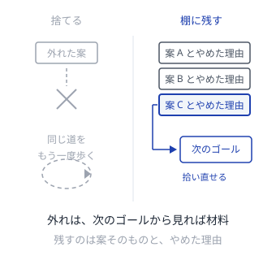
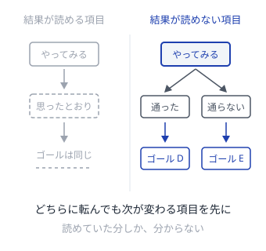
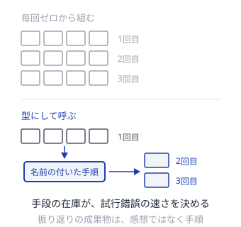

# ゴールは後から決まる

試行錯誤でゴールを見つけるスクラムのパターン

---

## 探し方
<!--id:探し方-->
<!--agenda-->
先にゴールを見つけ、次にその手段を見つける

### 立てる: [[仮のゴール]]
### 見せる: [[動くものが問う]]
### 判定: [[完成を先に決める]]
### 区切る: [[期限で問い直す]]
### 残す: [[外れを棚に残す]]
### 選ぶ: [[分からない順に取る]]
### 貯める: [[やり方を型にする]]
### 対応: [[patterns-agent/対応表|エージェントとの対応]]
### 背景: [[intro-scrum/探す理由|第1部 なぜ探すのか]]

---

## 仮のゴール
<!--id:仮のゴール-->
<!--pattern-->
### 状況
何を達成すべきかを決めきってから着手しようとする。

### 問題
決めきるだけの情報は、着手前には無い。
一度決めたゴールは、外れていても期の終わりまで生き延びる。
途中で分かったことが、ゴールの側に届かない。

### 解決
**ゴールを、期限付きの仮説として置く。**
「これができれば何が確かめられるか」を一文で書き、外れたら捨てる前提にする。
捨てた記録は [[外れを棚に残す]]。

<!--takeaway-->
関連: [[期限で問い直す]] / [[外れを棚に残す]] / [[patterns-agent/ゴールを立てさせる|ゴールを立てさせる]]

---

## 動くものが問う
<!--id:動くものが問う-->
<!--pattern-->
### 状況
何を作るべきかを、資料と会議で議論している。

### 問題
資料の空白は、読み手が想像で埋める。
埋め方は人ごとに違うので、合意しても全員が同じものを指していない。
本当の要望は、触れるものが出るまで言葉にならない。

### 解決
**毎回、触れるものを外に出す。**
見せる場を受け入れの場ではなく、次のゴールを見つける場として使う。
出てきた要望は、そのまま次の [[仮のゴール]] の材料になる。

<!--takeaway-->
関連: [[仮のゴール]] / [[分からない順に取る]] / [[patterns-agent/実行が判定する|実行が判定する]]

---

## 完成を先に決める
<!--id:完成を先に決める-->
<!--pattern-->
### 状況
ゴールが動くので、何をもって「できた」とするかも毎回揺れている。

### 問題
判定がゴールと一緒に動くと、どんな結果も達成に見えてしまう。
うまくいったのか分からない試行は、次の材料にならない。

### 解決
**完成の条件を、ゴールとは別に、先に決めて外に置く。**
ゴールは毎回差し替えてよい。差し替えないのは判定のほうにする。

<!--takeaway-->
関連: [[動くものが問う]] / [[patterns-agent/検査を先に書く|検査を先に書く]]

---

## 期限で問い直す
<!--id:期限で問い直す-->
<!--pattern-->
### 状況
見込みが外れていても、あと少しで終わりそうに見えて続けてしまう。

### 問題
ゴールを探す作業には、自然な終わりが無い。
終わりが無いものは、成果ではなく消耗で終わる。
やめる判断を各自の見切りに任せると、誰もやめない。

### 解決
**期間を先に固定し、期限では作業ではなくゴールを問い直す。**
延ばすのは期限ではなく、次に置く仮説のほう。

<!--takeaway-->
関連: [[仮のゴール]] / [[patterns-agent/予算で問い直す|予算で問い直す]]

---

## 外れを棚に残す
<!--id:外れを棚に残す-->
<!--pattern-->
### 状況
採らなかった案や、うまくいかなかった試みを、その場で捨てている。

### 問題
外れた理由は、次にゴールが変わったとき効いてくる。
消してしまうと、同じ道を同じ人がもう一度歩く。
拾い直せないと、ゴールを大胆に捨てる判断もできなくなる。

### 解決
**やめた案とやめた理由を、順番の付いた棚に残す。**
棚から拾い直せることが、ゴールを捨てられる条件になる。

<!--takeaway-->
関連: [[仮のゴール]] / [[patterns-agent/失敗も残す|失敗も残す]] / [[patterns-llm/追記で残す|追記で残す]]

---

## 分からない順に取る
<!--id:分からない順に取る-->
<!--pattern-->
### 状況
次にやることを、価値の見積もりが大きい順に並べている。

### 問題
ゴールがまだ仮説なら、その価値の見積もりも仮説の上に乗っている。
結果が読めている項目をいくら積んでも、読めていた分しか分からない。
ゴールは動かないまま、消化だけが進む。

### 解決
**結果がどちらに転んでも次の判断が変わる項目から取る。**
確実にできる項目は、分からない項目の後ろに置く。

<!--takeaway-->
関連: [[動くものが問う]] / [[patterns-agent/伸びしろで選ぶ|伸びしろで選ぶ]]

---

## やり方を型にする
<!--id:やり方を型にする-->
<!--pattern-->
### 状況
うまくいったやり方が、その回の記憶として個人に残っている。

### 問題
ゴールが変わるたびに、手段を毎回ゼロから組み直すことになる。
試行錯誤の速さは、手元にある手段の数で決まる。
在庫が増えないチームは、いつまでも同じ距離しか進めない。

### 解決
**通ったやり方に名前を付け、誰でも呼べる形にして残す。**
振り返りの成果物を感想ではなく、次から使える手順にする。

<!--takeaway-->
関連: [[分からない順に取る]] / [[patterns-agent/できたことを部品に|できたことを部品に]]
