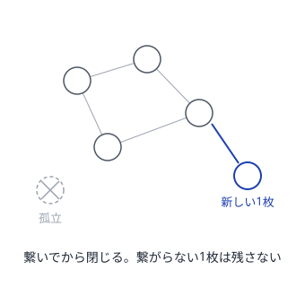
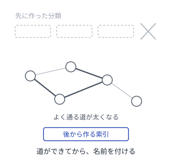
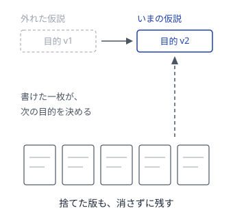
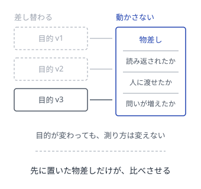
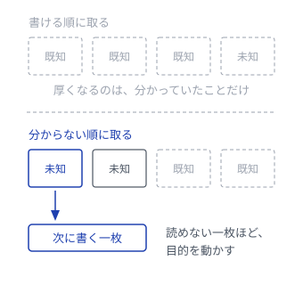

# Wiki が育つパターン

人が書き、AI が手入れする。育つ知識の作り方

---

## 読み方
<!--id:読み方-->
<!--agenda-->
順番に読んでもよいし、リンクを辿ってもよい

### 置く: [[種ノート]]
### 伸ばす: [[育つ見出し]]
### 割る: [[一枚一義]]
### 繋ぐ: [[つなぎ直し]]
### 索引: [[索引は後から]]
### 手入れ: [[剪定]]
### 束ねる: [[収穫]]
### 狙い: [[仮の目的]] / [[物差しは先に|物差し]] / [[分からない順]]
### AI: [[patterns-llm-wiki/LLM-Wiki|LLM Wiki]]
### 背景: [[intro-wiki/育てる理由|第1部 なぜ育てるのか]]

---

## 種ノート
<!--id:種ノート-->
<!--pattern-->
### 状況
思いついたことを、後で書こうと思って書かないまま忘れる。

### 問題
「ちゃんと書けるようになってから書こう」と待つと、その状態はいつまでも来ない。
整った文章を書くには時間がいるが、思いつきはその時間を待ってくれない。

### 解決
**一文でよいから置く。** 見出しだけでもよい。
育てるのは後の自分に任せる。育て方は [[育つ見出し]]。

<!--takeaway-->
関連: [[一枚一義]] / [[つなぎ直し]]

---

## 育つ見出し
<!--id:育つ見出し-->
<!--pattern-->
### 状況
[[種ノート]] が増えてきたが、どれも数行のまま止まっている。

### 問題
本文を厚くしようとすると手が止まる。書くことが無いからではなく、
そのノートが何を書く場所なのか、まだ決まっていないからである。

### 解決
**本文より先に見出しを増やす。** 見出しは「ここに何を書くか」の宣言で、
書く前に構造だけ育てられる。見出しが3つを超えたら [[一枚一義]] の出番。

<!--takeaway-->
関連: [[種ノート]] / [[一枚一義]]

---

## 一枚一義
<!--id:一枚一義-->
<!--pattern-->
### 状況
1枚のノートに話題が2つ以上混ざり、どこからも参照しにくくなっている。

### 問題
「あの話」を指したくてリンクを張っても、その先の半分は関係ない話になる。
そうして参照されなくなったノートは、二度と読み返されない。

### 解決
**1枚には1つのことだけ書く。** 混ざったら割る。
割ったノート同士は必ず [[つなぎ直し]] で繋ぐ。

<!--takeaway-->
関連: [[育つ見出し]] / [[つなぎ直し]]

---

## つなぎ直し
<!--id:つなぎ直し-->
<!--pattern-->
### 状況
ノートは増えたが、どれも孤立していて検索でしか辿り着けない。

### 問題
検索は、探す言葉を覚えているときしか効かない。
忘れてしまった知識は、忘れているせいで探す言葉も出てこない。

### 解決
**新しいノートは、必ず既存の1枚に繋いでから閉じる。**
繋ぎ先が思いつかないなら、それはまだ [[一枚一義]] になっていない兆候。

<!--takeaway-->
関連: [[索引は後から]] / [[剪定]]

---

## 索引は後から
<!--id:索引は後から-->
<!--pattern-->
### 状況
書き始める前に、きれいなカテゴリ体系を設計したくなる。

### 問題
中身がまだ無いうちに作った分類は、たいてい外れる。
しかも一度作った分類は、外れていても捨てにくい。

### 解決
**索引はリンクが溜まってから、事後に作る。**
どこへ繋がるかは [[つなぎ直し]] の結果が教えてくれる。
実際によく通る道だけを索引にする。

<!--takeaway-->
関連: [[つなぎ直し]] / [[収穫]] / [[index/入口|このサイトの索引]]

---

## 剪定
<!--id:剪定-->
<!--pattern-->
### 状況
古いノートが残り続け、どれが今も有効なのか分からない。

### 問題
消すのが惜しくて全部残すと、どれが今も有効なのか分からなくなる。
そうなると、正しい一枚まで信用されなくなる。

### 解決
**間違っていたノートは消さず、間違っていたと書き足す。**
消すのは重複だけ。判断の履歴は [[収穫]] の材料になる。

<!--takeaway-->
関連: [[つなぎ直し]] / [[収穫]]

---

## 収穫
<!--id:収穫-->
<!--pattern-->
### 状況
Wiki は育ったが、他人に見せられる形になっていない。

### 問題
育てることと、人に届けることは別の作業である。
リンクで繋がった網には、初めて読む人のための入口が無い。

### 解決
**よく参照されたノートを並べ替えて、1本の道にする。**
いま読んでいるこの並びが、その道である。
網そのものは [[索引は後から]] の形のまま残しておく。

<!--takeaway-->
関連: [[剪定]] / [[patterns-llm-wiki/LLM-Wiki|LLM Wiki]]

---

## 仮の目的
<!--id:仮の目的-->
<!--pattern-->
### 状況
何のために書き溜めるのかを決めきってから、書き始めようとする。

### 問題
決めきるだけの材料は、書く前には無い。何が役に立つかは、溜まってから分かる。
それでも一度掲げた目的は、外れていても残り続け、書いたものが目的に戻らなくなる。

### 解決
**目的も一枚のノートにして、捨てられる仮説として置く。**
「何が分かれば書いた甲斐があるか」を一文で書き、外れたら差し替える。
差し替えた履歴は [[剪定]] と同じで、消さずに書き足して残す。

<!--takeaway-->
関連: [[索引は後から]] / [[物差しは先に]] / [[剪定]]

---

## 物差しは先に
<!--id:物差しは先に-->
<!--pattern-->
### 状況
[[仮の目的]] を差し替えるたびに、「役に立った」の言い方も一緒に変わっている。

### 問題
測る物差しが目的と一緒に動くと、どの一枚も後から役に立ったことにできる。
そうして全部が成功に見えると、どれを伸ばし、どれを畳むかが決められない。

### 解決
**どうなれば役に立ったと言えるかを、目的とは別に、先に書いて動かさない。**
差し替えてよいのは目的のほうで、物差しのほうではない。
[[索引は後から]] と逆で、これだけは事前に置く。

<!--takeaway-->
関連: [[仮の目的]] / [[索引は後から]] / [[収穫]]

---

## 分からない順
<!--id:分からない順-->
<!--pattern-->
### 状況
次に書く一枚を、いちばん書きやすい話から選んでいる。

### 問題
書ける順に書くと、すでに分かっていることだけが厚くなる。
枚数は増えるのに、[[仮の目的]] は当たりも外れもしないまま動かない。

### 解決
**次の一枚は、まだ答えを持っていない話から取る。**
書いてみるまで結論が読めない一枚ほど、目的を差し替える材料になる。
答えられなかった問いを、そのまま [[種ノート]] にして置く。

<!--takeaway-->
関連: [[種ノート]] / [[仮の目的]] / [[patterns-llm-wiki/問いを置く|問いを置く]]
