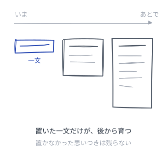
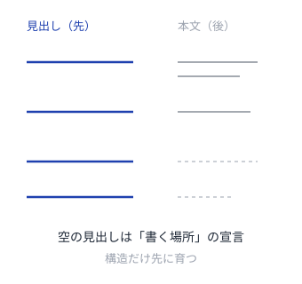
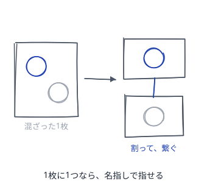
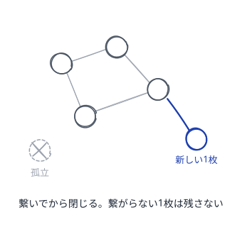
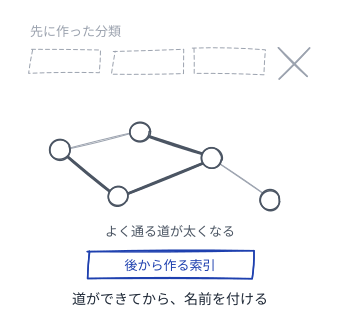
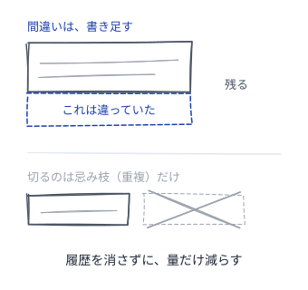
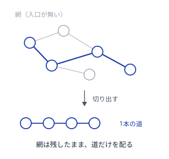
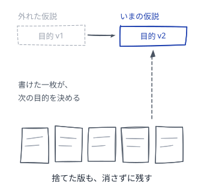
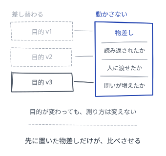
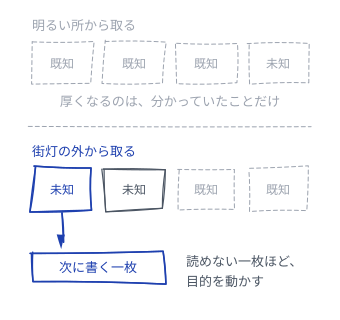

# Wiki が育つパターン

人が書き、AI が手入れする。育つ知識の作り方

---

## 読み方
<!--id:読み方-->
<!--agenda-->
順番に読んでもよいし、リンクを辿ってもよい

### 置く: [[種ノート]]
### 伸ばす: [[育つ見出し]]
### 割る: [[一枚一義]]
### 繋ぐ: [[接ぎ木]]
### 索引: [[けもの道]]
### 手入れ: [[剪定]]
### 束ねる: [[収穫]]
### 狙い: [[動く北極星]] / [[動かない物差し|物差し]] / [[街灯の外へ]]
### AI: [[patterns-llm-wiki/LLM-Wiki|LLM Wiki]]
### 背景: [[intro-wiki/育てる理由|第1部 なぜ育てるのか]]

---

## 種ノート
<!--id:種ノート-->
<!--pattern-->
### いつ・なにが困るか
思いついたことを、後で書こうと思ったまま忘れる。
思いつきは机の前ではなく、歩いている時に来る。

**「ちゃんと書けてから」と待つと、その時は来ない。**
整った文章には時間がいるが、思いつきは待てない。
待つあいだに、思いついた時の熱まで消える。

### そこで
**一文でよいから置く。** 見出しだけでもよい。
書きかけのままでも、読み返せれば資産になる。
育てるのは後の自分に。育て方は [[育つ見出し]]。

<!--takeaway-->
関連: [[一枚一義]] / [[接ぎ木]]

---

## 育つ見出し
<!--id:育つ見出し-->
<!--pattern-->
### いつ・なにが困るか
[[種ノート]] が増えたが、どれも数行で止まっている。
書き足そうと開いても、何を足すか分からず閉じる。

**本文を厚くしようとすると、手が止まる。**
書くことが無いからではなく、そのノートが
何を書く場所なのか決まっていないからである。

### そこで
**本文より先に見出しを増やす。** 見出しは宣言で、
本文を書かないまま構造だけを育てられる。
見出しが3つを超えたら [[一枚一義]] の出番。

<!--takeaway-->
関連: [[種ノート]] / [[一枚一義]]

---

## 一枚一義
<!--id:一枚一義-->
<!--pattern-->
### いつ・なにが困るか
1枚のノートに話題が2つ以上混ざっている。
書いている間は繋がって見え、自分では気づけない。

**リンクの先の半分が、関係ない話になる。**
半分が無関係なリンクは、辿った人の期待を裏切る。
一度裏切ったノートは、二度と読み返されない。

### そこで
**1枚には1つのことだけ書く。** 混ざったら割る。
一文で言い切れないなら、そこには2枚ある。
割ったノートは必ず [[接ぎ木]] で繋ぐ。

<!--takeaway-->
関連: [[育つ見出し]] / [[接ぎ木]]

---

## 接ぎ木
<!--id:接ぎ木-->
<!--pattern-->
### いつ・なにが困るか
ノートは増えたが、どれも孤立している。
検索で足りるのは、全部を覚えているうちだけ。

**検索は、探す言葉を覚えていないと効かない。**
忘れた知識は、探す言葉のほうも出てこない。
読み返す価値のある一枚から、辿れなくなる。

### そこで
**新しいノートは、既存の1枚に繋いでから閉じる。**
繋いだ相手が入口になり、道が思い出させてくれる。
繋ぎ先が無いなら、まだ [[一枚一義]] でない兆候。

<!--takeaway-->
関連: [[けもの道]] / [[剪定]]

---

## けもの道
<!--id:けもの道-->
<!--pattern-->
### いつ・なにが困るか
書き始める前に、きれいな分類を設計したくなる。
先に棚を組めば、後から迷わず片付くと思える。

**中身が無いうちに作った分類は、たいてい外れる。**
何がどれだけ溜まるかは、溜めるまで分からない。
外れた分類は捨てにくく、書くほうが合わせ始める。

### そこで
**索引はリンクが溜まってから、事後に作る。**
どこへ繋がるかは [[接ぎ木]] が教えてくれる。
よく通る道だけを索引にすれば、外れようがない。

<!--takeaway-->
関連: [[接ぎ木]] / [[収穫]] / [[index/入口|このサイトの索引]]

---

## 剪定（せんてい）
<!--id:剪定-->
<!--pattern-->
### いつ・なにが困るか
古いノートが残り、どれが今も有効か分からない。
書いた当時は正しく、今は違う一枚が見分けにくい。

**全部残すと、正しい一枚まで信用されなくなる。**
読む側は確かめる手間を嫌い、Wiki ごと離れる。
かといって消すと、なぜそう考えたかまで消える。

### そこで
**間違っていたノートは消さず、間違いと書き足す。**
消してよいのは重複だけ。外れ方まで伝わる。
残した判断の履歴は [[収穫]] の材料になる。

<!--takeaway-->
関連: [[接ぎ木]] / [[収穫]]

---

## 収穫
<!--id:収穫-->
<!--pattern-->
### いつ・なにが困るか
Wiki は育ったが、人に見せられる形ではない。
自分はどこからでも読めるので、不便に気づかない。

**育てることと、人に届けることは別の作業である。**
リンクの網には、初めて読む人の入口が無い。
どこから入っても全体が見えず、数枚で引き返す。

### そこで
**よく参照されたノートを並べて、1本の道にする。**
いま読んでいるこの並びが、その道である。
網そのものは [[けもの道]] の形で残しておく。

<!--takeaway-->
関連: [[剪定]] / [[patterns-llm-wiki/LLM-Wiki|LLM Wiki]]

---

## 動く北極星
<!--id:動く北極星-->
<!--pattern-->
### いつ・なにが困るか
何のために書き溜めるのかを、決めきろうとする。
目的が定まらないまま書くのは、無駄骨に思える。

**決めきるだけの材料は、書く前には無い。**
何が役に立つかは、溜まってから分かる。
外れた目的が残ると、書いたものが戻らなくなる。

### そこで
**目的も一枚にして、捨てられる仮説として置く。**
「何が分かれば書いた甲斐があるか」を一文で書く。
外れたら差し替え、履歴は [[剪定]] と同じで残す。

<!--takeaway-->
関連: [[けもの道]] / [[動かない物差し]] / [[剪定]]

---

## 動かない物差し
<!--id:動かない物差し-->
<!--pattern-->
### いつ・なにが困るか
[[動く北極星]] を差し替えるたび、言い方も変わる。
書いた後で理由を見つけるので、修正に見える。

**物差しが目的と動くと、何でも成功にできる。**
どの一枚も後から役に立ったことにできてしまう。
全部が成功に見えると、伸ばす先を選べない。

### そこで
**役に立ったと言える形を、先に書いて動かさない。**
差し替えてよいのは目的で、物差しではない。
[[けもの道]] と逆で、これだけは事前に置く。

<!--takeaway-->
関連: [[動く北極星]] / [[けもの道]] / [[収穫]]

---

## 街灯の外へ
<!--id:街灯の外へ-->
<!--pattern-->
### いつ・なにが困るか
次の一枚を、いちばん書きやすい話から選んでいる。
手が動く題材なら、書けた分だけ進んだ気になる。

**書ける順に書くと、分かる話だけが厚くなる。**
枚数は増えても、[[動く北極星]] を動かせない。
知らないことは、知らないまま端に残り続ける。

### そこで
**次の一枚は、まだ答えを持っていない話から取る。**
結論が読めない一枚ほど、目的を試す材料になる。
答えられなかった問いは [[種ノート]] にして置く。

<!--takeaway-->
関連: [[種ノート]] / [[動く北極星]] / [[patterns-llm-wiki/問いを置く|問いを置く]]
