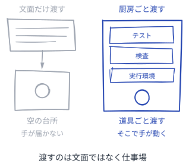
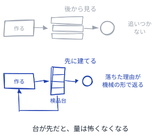
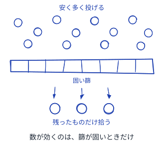
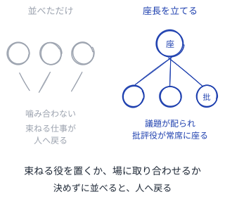
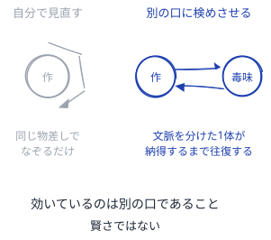
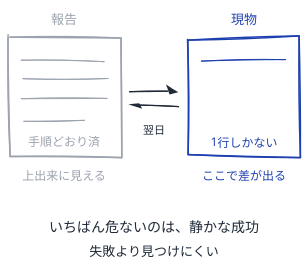
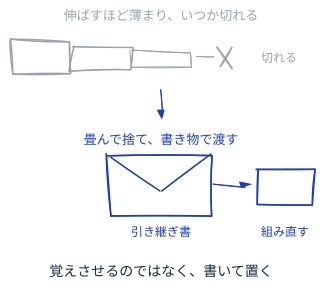
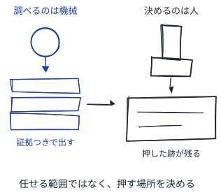

# AIエージェントと働くパターン

仕込む・任せる・確かめる・残す。仕事の一周をエージェントと回す

---

## 読み方
<!--id:読み方-->
<!--agenda-->
仕事の一周の順に並べ、4つの節に分けて引く

### 仕込む: [渡す前](patterns-agent.md#渡す前)
### 任せる: [走らせる](patterns-agent.md#走らせる)
### 確かめる: [受け取る](patterns-agent.md#受け取る)
### 残す: [次へ渡す](patterns-agent.md#次へ渡す)
### 書き方: [パターンを書くパターン](patterns-meta.md#読み方)
### 隣: [Wiki が育つパターン](patterns-wiki.md#読み方)

---

## 渡す前
<!--id:渡す前-->
<!--agenda-->
頼み方を練るより、渡す場の作りで決まる

### 場: [厨房ごと渡す](patterns-agent.md#厨房ごと渡す)
### 篩: [検品台が先](patterns-agent.md#検品台が先)
### 次: [走らせる](patterns-agent.md#走らせる)
### 目次: [読み方](patterns-agent.md#読み方)

---

## 走らせる
<!--id:走らせる-->
<!--agenda-->
1体を賢くするより、並べ方のほうが効く

### 数: [投網を打つ](patterns-agent.md#投網を打つ)
### 束: [座長を立てる](patterns-agent.md#座長を立てる)
### 次: [受け取る](patterns-agent.md#受け取る)
### 目次: [読み方](patterns-agent.md#読み方)

---

## 受け取る
<!--id:受け取る-->
<!--agenda-->
上出来に見える報告ほど、確かめる先が要る

### 口: [毒味役を置く](patterns-agent.md#毒味役を置く)
### 物: [現物合わせ](patterns-agent.md#現物合わせ)
### 次: [次へ渡す](patterns-agent.md#次へ渡す)
### 目次: [読み方](patterns-agent.md#読み方)

---

## 次へ渡す
<!--id:次へ渡す-->
<!--agenda-->
1回で終わる仕事は、任せる値打ちがない

### 書: [置き手紙](patterns-agent.md#置き手紙)
### 印: [判子は人が押す](patterns-agent.md#判子は人が押す)
### 戻る: [読み方](patterns-agent.md#読み方)

---

## 厨房ごと渡す
<!--id:厨房ごと渡す-->
<!--pattern-->
### いつ・なにが困るか
エージェントに頼む文面を、何度も練り直す。
指示が足りないから外すのだと思っている。

**足りないのは指示ではなく、道具と足場である。**
手が届かないものは、書き方を変えても届かない。
練るほど文面は伸び、読ませる手間だけが増える。

### そこで
**文面ではなく、厨房ごと渡す。**
テストと検査と実行環境を、先に台所へ揃える。
何を揃えるかは [検品台が先](patterns-agent.md#検品台が先) が決める。

<!--source-->
OpenAI "Harness engineering: leveraging Codex in an agent-first world" (2026)＝harness とはエージェントを取り囲む足場・制約・フィードバックの総体で、リポジトリ構成・CI・整形規則・プロジェクト指示・linter を含む。／Anthropic "Building a C compiler…" (2026)＝労力の大半は Claude の周りの環境の設計に費やされた。

---

## 厨房ごと渡すの3例
<!--id:厨房ごと渡す-例-->
<!--icon-cols-->
### Codex の harness
<!--icon:mi:terminal-->
5か月・約100万行を人の手書きゼロで出した。人が書いたのは規約と CI と検査で、コードではない。
### Claude Science
<!--icon:mi:biotech-->
60を超える科学データベースと解析ツールを1つの作業台に集めてから、エージェントに走らせる。
### 一人起業
<!--icon:mi:storefront-->
残る資産は自前の手順と溜めたデータと連携で、頼み方の巧さではない。
<!--takeaway-->
どれも、渡したのは指示ではなく仕事場のほうである。

---

## 検品台が先
<!--id:検品台が先-->
<!--pattern-->
### いつ・なにが困るか
まず作らせて、出てきた物を後から見る。
動く物が先にあれば、直す点も見えると思う。

**後から見る検査は、作った量に追いつかない。**
もっともらしい物ほど、流し読みで通ってしまう。
通した数だけ、後で剥がす手間が積み上がる。

### そこで
**作り手より先に、落とす台を建てる。**
落ちた理由が機械の読める形で返れば、独りで直る。
台が甘いまま [投網を打つ](patterns-agent.md#投網を打つ) と、選別が人に戻る。

<!--source-->
Anthropic "Effective harnesses for long-running agents" (2026)＝検証は最後の点検ではなく第一級の入口で、ビルド失敗・プレビュー異常・ルーブリック違反・見た目の食い違いを機械可読なフィードバックとして即座に返す。／同 "Building a C compiler…"＝タスクの検証器はほぼ完璧である必要があり、失敗の型を見つけては新しいテストを設計し続けた。

---

## 検品台が先の3例
<!--id:検品台が先-例-->
<!--icon-cols-->
### C コンパイラ
<!--icon:mi:rule-->
テスト群を集め、検証器とビルド手順を書き、失敗の型を見つけては新しいテストを足し続けた。
### 捏造引用
<!--icon:mi:menu-book-->
書式は正しく、実在の研究者に帰され、日付ももっともらしい。後から読む検査では止まらない。
### 一人起業
<!--icon:mi:storefront-->
問題、需要の確認、先に売る、MVP、自動化の順。作る前に落とす台を通す。
<!--takeaway-->
落とす台が先にあると、出てくる量は怖くなくなる。

---

## 投網を打つ
<!--id:投網を打つ-->
<!--pattern-->
### いつ・なにが困るか
1回で当てたいので、頼み方を丁寧に整える。
走らせる回数が減れば、費用も抑えられる。

**1回に賭けるほど、外したときの損が大きい。**
どれが当たりかは、走らせる前には分からない。
整える時間が、そのまま試す回数を食っている。

### そこで
**安く多く投げて、篩にかける。**
選別を [検品台が先](patterns-agent.md#検品台が先) に任せれば、数は怖くない。
篩が人の目しかないなら、投げる数を先に減らす。

<!--source-->
Anthropic "Building a C compiler with a team of parallel Claudes" (2026)＝16体を並列に走らせ、約2,000セッション・約2万ドルで10万行のコンパイラを作った。／Swanson ら "The Virtual Lab of AI agents designs new SARS-CoV-2 nanobodies" (bioRxiv 2024 / 査読版 2025)＝92個のナノボディ候補を設計し、実験で有望だったのはそのうち数個。

---

## 投網を打つの3例
<!--id:投網を打つ-例-->
<!--icon-cols-->
### C コンパイラ
<!--icon:mi:terminal-->
16体が並列に約2,000セッションを回した。1体を賢くしたのではなく、数と篩で通した。
### Virtual Lab
<!--icon:mi:science-->
92個のナノボディ候補を設計し、実験で残ったのは数個。設計にかかったのは数日だった。
### 一人起業
<!--icon:mi:storefront-->
小さく多く出し、需要の出た1つだけ残す。外れが安いほど、打てる回数が増える。
<!--takeaway-->
数が効くのは、篩が固いときだけである。

---

## 座長を立てる
<!--id:座長を立てる-->
<!--pattern-->
### いつ・なにが困るか
専門の違うエージェントを、何体も並べて走らせる。
得意が揃えば、答えも揃うはずだと思う。

**並べただけでは、話が噛み合わない。**
誰も全体を見ないので、抜けも重なりも残る。
束ねる仕事が、そのつど人の手元へ戻ってくる。

### そこで
**専門家を並べる前に、束ねる1体を置く。**
座長が議題を配り、[毒味役を置く](patterns-agent.md#毒味役を置く) を常席に加える。
逆に、共有の作業場だけで取り合わせる形もある。

<!--source-->
Virtual Lab（Zou ら, 2024 / 2025）＝LLM の PI エージェントが専門家エージェント（化学者・計算機科学者・批評役）を率い、研究会の形で進める。人は高次のフィードバックだけを返す。／Claude Science (2026)＝調整役エージェントが専門サブエージェントに仕事を配る。／逆向きの形は Anthropic の C コンパイラで、座長を置かず Git のロックで取り合わせた。

---

## 座長を立てるの3例
<!--id:座長を立てる-例-->
<!--icon-cols-->
### Virtual Lab
<!--icon:mi:groups-->
PI エージェントが化学者と計算機科学者と批評役を率い、研究会の形で議論を回す。
### Claude Science
<!--icon:mi:biotech-->
調整役エージェントが専門サブエージェントに仕事を配り、別立ての査読役が結果を検める。
### C コンパイラ
<!--icon:mi:hub-->
逆に座長を置かず、Git のロックで持ち場を取り合わせた。衝突が別を取れの合図になる。
<!--takeaway-->
束ねる役を置くか、場に取り合わせるか。決めずに並べると人へ戻る。

---

## 毒味役を置く
<!--id:毒味役を置く-->
<!--pattern-->
### いつ・なにが困るか
書いた本人に、自分の出来を見直させる。
同じ文脈を持つぶん、早くて安いと思う。

**自分の粗は、自分の物差しでは測れない。**
通した理由をもう一度なぞるだけで終わる。
見落としは、見落としたまま次へ渡っていく。

### そこで
**検めるのは、作った本人と別の口にやらせる。**
文脈を分けた1体が、納得するまで往復する。
[黙って聴く著者](patterns-meta.md#黙って聴く著者) と同じで、作った側は黙る。

<!--source-->
Virtual Lab（Zou ら）＝批評役エージェントをチームに常置する。／Claude Science (2026)＝別立ての査読エージェントが引用と計算をすべて照合し、誤りをその場で直す。／OpenAI "Harness engineering" (2026)＝Codex に自分の変更をローカルでレビューさせたうえで、別のレビュー用エージェントを呼び、全員が納得するまで回す。

---

## 毒味役を置くの3例
<!--id:毒味役を置く-例-->
<!--icon-cols-->
### Virtual Lab
<!--icon:mi:groups-->
批評役エージェントをチームに常置し、研究会のたびに反対する口を1つ残しておく。
### Claude Science
<!--icon:mi:fact-check-->
査読役エージェントが引用と計算をすべて照合し、見つけた誤りをその場で直す。
### Codex
<!--icon:mi:rate-review-->
自分の変更を見直させたうえで別のレビュー役を呼び、全員が納得するまで往復する。
<!--takeaway-->
効いているのは別の口であることで、賢さではない。

---

## 現物合わせ
<!--id:現物合わせ-->
<!--pattern-->
### いつ・なにが困るか
走り終えた報告を読んで、済んだことにする。
手順どおりと書いてあれば、疑う気が起きない。

**いちばん危ないのは、静かな成功である。**
失敗は目に付くが、していない成功は目に付かない。
気づくのは、後から現物を見た誰かだけになる。

### そこで
**報告ではなく、翌日の現物と突き合わせる。**
自己申告と実際の結果を並べる仕掛けを、外に置く。
落ちた分は [検品台が先](patterns-agent.md#検品台が先) に足す。

<!--source-->
一人起業の実務報告（2026）＝自己申告と24時間後の実際を突き合わせる日次バッチが、失敗全体の30〜40%を占める「静かな成功」を捕まえる。／捏造引用の調査（Nature ほか, 2026）＝書式は正しく実在の研究者に帰され、日付ももっともらしい。2026年最初の7週で277本に1本。／生成コードの信頼に関する調査＝完全には信頼しない開発者が96%、必ず検証するのは48%。

---

## 現物合わせの3例
<!--id:現物合わせ-例-->
<!--icon-cols-->
### 一人起業
<!--icon:mi:receipt-long-->
自己申告と24時間後の実際を突き合わせる日次バッチが、失敗の30〜40%を占める静かな成功を捕まえる。
### 研究の引用
<!--icon:mi:menu-book-->
書式も所属も日付も正しく見える。2026年の最初の7週で、277本に1本が捏造を含んだ。
### 生成コード
<!--icon:mi:terminal-->
完全には信頼しない開発者が96%。それでもコミット前に必ず検証するのは48%だった。
<!--takeaway-->
報告の見栄えが良くなるほど、現物を見る癖が要る。

---

## 置き手紙
<!--id:置き手紙-->
<!--pattern-->
### いつ・なにが困るか
長い仕事を、1つの文脈のまま続けさせる。
覚えているうちは、渡し直す手間が惜しい。

**文脈は伸ばすほど薄まり、いつか切れる。**
要約して詰め直しても、長い仕事には足りない。
切れた場所から先は、誰も引き継げなくなる。

### そこで
**文脈は畳んで捨て、書き物で次へ渡す。**
引き継ぎ書から組み直せば、何回でも続けられる。
置き場は [種ノート](patterns-wiki.md#種ノート) と同じで、机の上でよい。

<!--source-->
Anthropic "Effective harnesses for long-running agents" (2026)＝要約による圧縮では長い仕事に足りず、セッションを畳んで構造化された引き継ぎファイルから組み直す全面リセットが要った。文脈は有限で手入れの要る資源として扱う。／Kosmos（Edison Scientific / FutureHouse, 2026）＝構造化された世界モデルで、1回の走行に1,500本の論文と42,000行の解析コードを通す。

---

## 置き手紙の3例
<!--id:置き手紙-例-->
<!--icon-cols-->
### 長時間の開発
<!--icon:mi:restart-alt-->
要約では足りず、セッションを畳んで引き継ぎファイルから組み直す全面リセットが要った。
### Kosmos
<!--icon:mi:science-->
構造化された世界モデルで、1回の走行に1,500本の論文と42,000行の解析コードを通す。
### 一人起業
<!--icon:mi:edit-note-->
走らせる前に意図のログを1本置く。5行のコードで、失敗のおよそ30%が捕まる。
<!--takeaway-->
覚えさせるのではなく、書いて置いていく。

---

## 判子は人が押す
<!--id:判子は人が押す-->
<!--pattern-->
### いつ・なにが困るか
調べも判断も、まとめてエージェントに任せる。
根拠まで出してくるので、そのまま通してしまう。

**証拠を集める力と、引き受ける力は別である。**
外したときに責めを負うのは、任せた側である。
誰も押していない判断は、後から辿り直せない。

### そこで
**調べるのは機械、決めるのは人にする。**
エージェントには証拠つきで出させ、選ぶ場を残す。
外へ出す物は [毒味役を置く](patterns-agent.md#毒味役を置く) を通してから押す。

<!--source-->
「エージェントは証拠つきで調べ、人は判断の要る決定をする」という切り分けは、2026年のレビュー実務に繰り返し現れる。／Robin（FutureHouse, 2025）＝仮説・実験設計・解析・図はエージェントが出し、物理実験を回すのは人だった。／Virtual Lab（Zou ら）＝人が返すのは高次のフィードバックだけ。／一人起業の実務報告＝顧客に届くものはレビューなしに出さない。

---

## 判子は人が押すの3例
<!--id:判子は人が押す-例-->
<!--icon-cols-->
### Robin
<!--icon:mi:science-->
仮説も実験設計も解析も図もエージェントが出した。物理実験を回したのは人だった。
### Virtual Lab
<!--icon:mi:groups-->
人が返すのは高次のフィードバックだけ。問いを立てる場所と、受け取る場所に残る。
### 一人起業
<!--icon:mi:approval-->
顧客に届くものは、レビューを通さずに出さない。届いた後では取り消せない。
<!--takeaway-->
任せる範囲ではなく、判子を押す場所のほうを決める。
