# 任せ先のパターン

「AI に任せる」を、6つの任せ先と6つの土台に割る

---

## 引き方
<!--id:引き方-->
<!--agenda-->
選ぶ側から引いてもよいし、土台の側から引いてもよい

### 規則: [[型で抜く]]
### 予測: [[利き酒]]
### 一往復: [[窓口]]
### 自律: [[お使い]]
### 分業: [[手分け]]
### 人: [[誰が謝るか]]
### 境目: [[線路と原っぱ]]
### 材料: [[買い出し]] / [[口伝を捨てる]] / [[帳簿]]
### 接続: [[コンセント]]
### 検査: [[答案用紙]]
### 背景: [[intro-delegation/任せ先|第1部 なぜ割るのか]]
### 別版: [[patterns-solutions/引き方-部品|同じ話を部品の名前で]]

---

## 型で抜く
<!--id:型で抜く-->
<!--pattern-->
### いつ・なにが困るか
条件が決まりきった判定を、AI に毎回読ませている。
賢い相手に任せておけば、間違いも減ると思える。

**決まっている答えを、毎回引き直す必要はない。**
引き直すたびに料金がかかり、たまに違う答えが出る。
理由も毎回違うので、監査でも再現でも詰まる。

### そこで
**書き下せる規則は、規則のまま書き下す。**
分岐が数えられるなら、そこは AI の出番ではない。
数えられない所だけ残す。境目は [[線路と原っぱ]]。

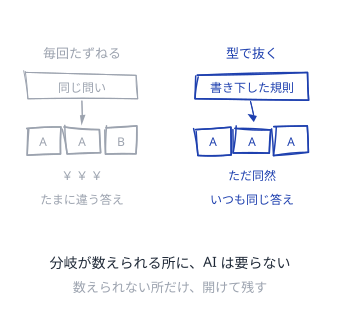

<!--source-->
Anthropic "Building Effective Agents"（2024-12）＝まず最も単純な解を探し、必要なときだけ複雑さを足す。エージェント的なシステムを作らないという選択肢も含む。

---

## 利き酒
<!--id:利き酒-->
<!--pattern-->
### いつ・なにが困るか
数値の予測や仕分けまで、LLM に文章で答えさせる。
賢い相手ひとつで通したほうが、作りは簡単に見える。

**予測は、言葉の上手さでは当たらない。**
一件あたりの値段は百倍を超え、返る速さも桁で違う。
なぜその値かも言えないので、外した先を直せない。

### そこで
**表に並ぶ予測は、事例を積んだ側に任せる。**
要るのは説明ではなく、正解の付いた過去の山である。
山が無いなら、先に [[帳簿]] のほうを作る。

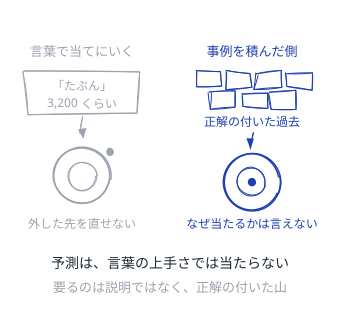

<!--source-->
構造化データの予測では従来型 ML が精度・遅延・費用・説明可能性で LLM を上回る。1リクエストあたり約100〜1000倍の費用差があり、従来モデルは CPU 上で 5ms 以下に返る（Medium "Why Classic ML Still Outperforms LLMs in High-Stakes Prediction Scenarios", 2026-05 ほか）。

---

## 窓口
<!--id:窓口-->
<!--pattern-->
### いつ・なにが困るか
文章を直す・要約する程度の用に、道具を持たせて回す。
自律させておいたほうが、気が利くように思える。

**一往復で済む用に、席を立たせる必要はない。**
回すほど失敗の種類が増え、返るまでの時間も伸びる。
何をしたのか後から追う手間だけが、静かに積み上がる。

### そこで
**渡した材料の中で終わる用は、一往復で頼む。**
外へ取りに行く必要が出て、初めて [[お使い]] に替える。
材料の集め方は [[買い出し]] が引き受ける。

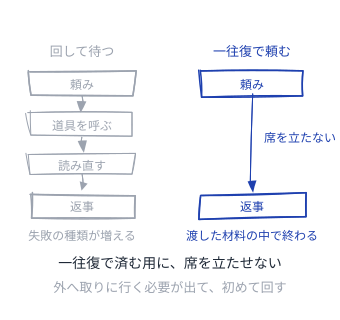

<!--source-->
Anthropic はワークフロー（あらかじめ書いた道筋で LLM と道具を動かす）とエージェント（LLM が自分で道筋を決める）を分け、予測可能な仕事にはワークフローを勧める。

---

## お使い
<!--id:お使い-->
<!--pattern-->
### いつ・なにが困るか
道順まで書ける仕事に、目的だけ渡して行かせる。
自分で考えて動くほうが、速く着くように思える。

**道順が書けるなら、書いたほうが速くて安い。**
毎回ちがう道を通るので、失敗も毎回ちがう形で出る。
一歩ずつの成功率は掛け算で減り、長い道ほど戻らない。

### そこで
**道順が描けない仕事にだけ、目的を渡す。**
描ける所は [[線路と原っぱ]] の線路の側に置く。
帰りが遅い時に備え、途中で降ろす駅を決めておく。

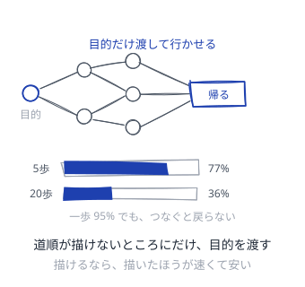

<!--source-->
一歩あたり 95% でも 20 歩つなぐと全体は 0.95^20 ≒ 36%（誤りは相関するので実際はこれより悪い）。METR は「50% の確率でやり切れる仕事の長さ」が 2019 年以降およそ7か月で倍化していると報告し、2025 年前半で約55分、o3 級で約110分としている。

---

## 手分け
<!--id:手分け-->
<!--pattern-->
### いつ・なにが困るか
一人で足りているうちから、役割を分けて並べたくなる。
人の組織に似せるほど、賢くなるように思える。

**分けた瞬間、渡し忘れた文脈が失敗になる。**
費用は一往復の十数倍に膨らみ、答えも互いに揃わない。
実行記録の調査では、失敗率は4割から9割近くに達した。

### そこで
**一つの頭に材料が入りきらない時だけ、手分けする。**
条件は、探す道が互いに独立していて値段に見合うこと。
揃わなかった答えは [[答案用紙]] で落とす。

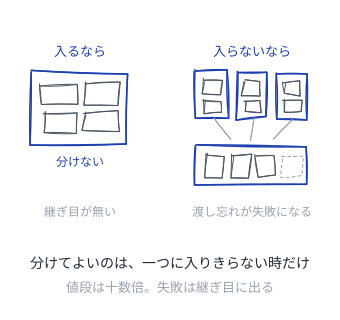

<!--source-->
Anthropic の研究用マルチエージェント（Opus 4 が Sonnet 4 の部下を指揮）は単体を 90.2% 上回った一方、消費トークンは通常の対話の約15倍で、トークン量が性能差の約8割を説明した。UC Berkeley が7つのフレームワークの実行記録 1,642 件を解析した MAST では、失敗率は 41〜86.7%。

---

## 誰が謝るか
<!--id:誰が謝るか-->
<!--pattern-->
### いつ・なにが困るか
精度が上がってきたので、判断そのものを渡したくなる。
人が見ているという建前だけ、手続きとして残す。

**見ているだけの人は、たいてい追認する。**
出てきた答えに寄る癖は、法の条文にも名指しされている。
事故が起きて初めて、謝る人がいないことが分かる。

### そこで
**間違えた時に謝る人を、任せる前に決める。**
決まらない仕事は、精度がいくら高くても渡さない。
渡す範囲は、取り返しのつく所までにする。

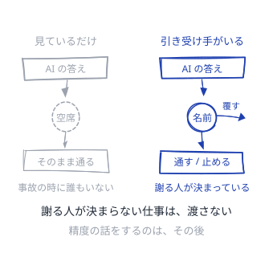

<!--source-->
EU AI Act 第14条（人間による監督）＝監督者はシステムの能力と限界を理解し、自動化バイアス（出力に自動的に依存・過度に依存する傾向）に注意を払い、出力を覆す・使わないと決められること。／Gartner は 2027 年末までに agentic AI の案件の4割超が費用・価値の不明確さ・リスク統制の不足で中止されると予測（2025-06）。

---

## 線路と原っぱ
<!--id:線路と原っぱ-->
<!--pattern-->
### いつ・なにが困るか
どこまで自律させるかを、道具を選ぶ時に決めてしまう。
全部を任せるか、全部を書くかの二択になっている。

**一本の仕事の中でも、決まり方は場所ごとに違う。**
決まっている所まで任せると、揺れなくてよい所が揺れる。
決まらない所を書き下すと、例外のたびに直しが要る。

### そこで
**既定は線路。原っぱは要る所だけ開ける。**
判断の要る一歩にだけ [[お使い]] を置き、前後は書き下す。
線路の敷き方は [[型で抜く]]。

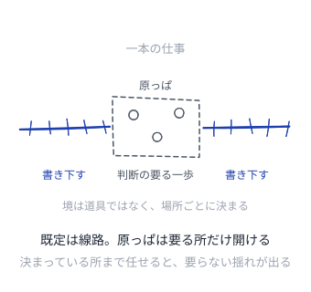

<!--source-->
Anthropic "Building Effective Agents"＝予測可能で決まった仕事にはワークフロー、柔軟さとモデル主導の判断が要る場面にはエージェント。既定はワークフローで、複雑さは必要になってから足す。

---

## 買い出し
<!--id:買い出し-->
<!--pattern-->
### いつ・なにが困るか
社内の事情を、モデル自身に覚え込ませようとする。
一度覚えさせてしまえば、あとは速いように思える。

**覚えたものは、変わった日から間違いになる。**
覚え直しは高く、何を覚えたかも外からは見えない。
かといって毎回すべて渡すと、料金が桁で変わる。

### そこで
**変わるものは覚えさせず、要る時に取りに行く。**
覚えさせるのは、変わらない作法や出力の形のほうだけ。
取りに行く先の中身は [[口伝を捨てる]] が用意する。

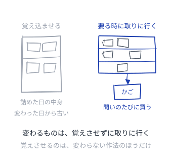

<!--source-->
ファインチューニングは「どう振る舞うか」、RAG は「いま何を知っているべきか」を担う。長文脈にすべて載せる方式は規模が出ると RAG の 20〜24 倍の費用になり、更新の速いデータでは RAG が最大9割安いという報告がある。

---

## 口伝を捨てる
<!--id:口伝を捨てる-->
<!--pattern-->
### いつ・なにが困るか
手順や判断の理由が、人の頭と会話の中にだけある。
聞けば分かるので、書き出す動機がなかなか湧かない。

**聞かないと分からないことは、AI には渡らない。**
渡らないまま任せると、それらしい答えが返ってくる。
確かめる術も無いので、間違いが静かに広がっていく。

### そこで
**任せたい仕事の前提を、読める形で外に置く。**
置き方は [[patterns-wiki/種ノート|種ノート]]、手入れは [[patterns-llm-wiki/司書|司書]] に。
渡す分量は [[patterns-llm-wiki/近所だけ渡す|近所だけ渡す]]。

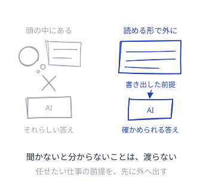

<!--source-->
MIT "The GenAI Divide: State of AI in Business 2025"＝経営者は規制やモデル性能を原因に挙げるが、調査が指したのは組織側の「学習の断絶」と統合の失敗だった。

---

## 帳簿
<!--id:帳簿-->
<!--pattern-->
### いつ・なにが困るか
事業の出来事が、画面の中と担当者の記憶にしかない。
数字は聞けば出てくるので、困っていないように見える。

**残していない出来事は、後から数えられない。**
任せた相手は、数えられない代わりに言葉で埋めてくる。
埋めた答えは、合っているかどうかも確かめられない。

### そこで
**問いより先に、出来事のほうを残しておく。**
何を問われるか読めないので、形は決めきらずに積む。
積み方は [[patterns-llm-wiki/年輪|年輪]]、直し方は [[patterns-llm-wiki/鏡は拭かない|鏡は拭かない]]。

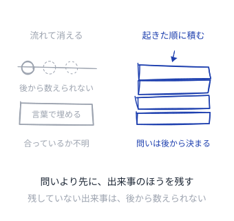

<!--source-->
MIT の同調査は 52 件の役員面談・153 名の調査・300 件の公開事例を基に、95% の試行が損益への計測可能な影響を出せなかったと報告した。価値が出たのは全体の 5%。

---

## コンセント
<!--id:コンセント-->
<!--pattern-->
### いつ・なにが困るか
道具を増やすたび、繋ぎ込みを一本ずつ手で作っている。
相手が増えるほど、配線は掛け算で増えていく。

**専用の配線は、作った人しか差し替えられない。**
道具を替えるだけで、繋いだ側まで書き直しになる。
誰が何に触れるのかも、配線を読まないと分からない。

### そこで
**差込口の形をそろえ、道具の側を差し替え可能にする。**
そろえた口は誰でも挿せるので、鍵と記録を口に付ける。
挿した先の中身は [[帳簿]] と [[口伝を捨てる]]。

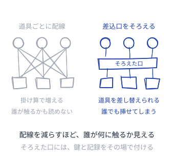

<!--source-->
MCP は 2024-11 に Anthropic が公開し、2025-12 に Linux Foundation 傘下の Agentic AI Foundation へ寄贈されて単一ベンダの製品判断から離れた。2026 年時点で公開サーバ 9,400 件超。2025-11 の仕様更新で非同期処理・サーバの本人確認・監査証跡が入った。

---

## 答案用紙
<!--id:答案用紙-->
<!--pattern-->
### いつ・なにが困るか
出来のよさを、触った人の感想で判断している。
動いているようには見えるので、測る動機が湧かない。

**感想は、良くなったのか慣れたのか区別できない。**
直すたびに前より悪くなっても、誰も気づけない。
気づけないまま、任せる範囲だけが広がっていく。

### そこで
**任せる前に、合格の形を答案にして固定する。**
機械で合否の出る所は [[patterns-llm-wiki/実行可能な規約|実行可能な規約]] に落とす。
落ちない所は、答えの例を並べて人が採点する。

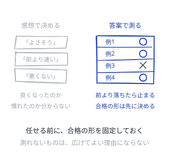

<!--source-->
Gartner は「agent washing」＝既存のアシスタント・RPA・チャットボットを実体の伴わないまま agentic と言い換える動きを指摘し、数千を名乗るベンダのうち実体があるのは約130社と見積もった。名乗りと実体を分ける物差しは、買う側が持つしかない。
