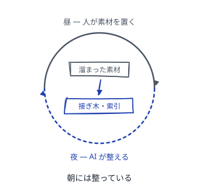
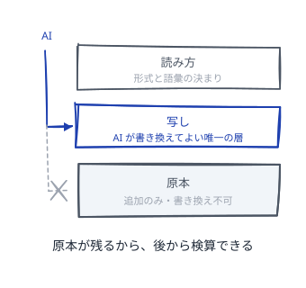
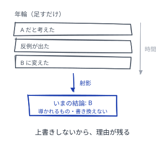
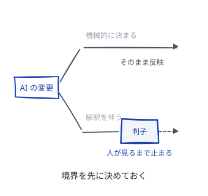
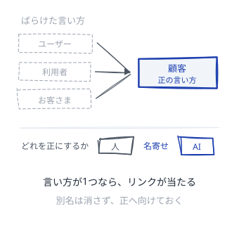
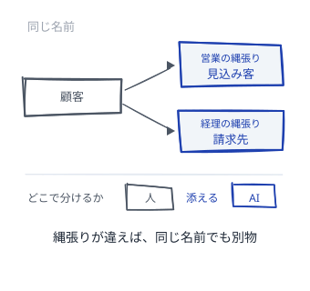
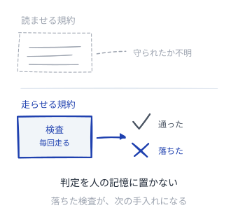
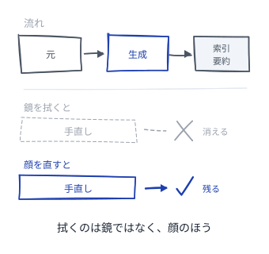
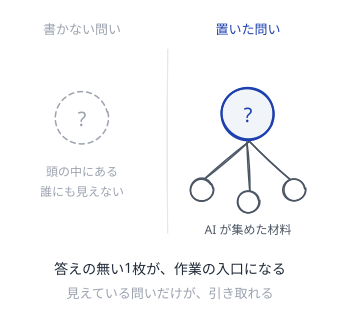
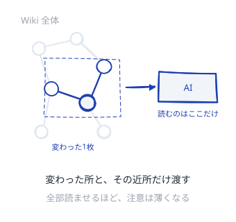

# LLM が手入れする Wiki

AI が司書として入ってくる Wiki のパターン

---

## LLM Wiki
<!--id:LLM-Wiki-->
<!--agenda-->
人は観察と判断を入れ、AI は規約に従って整える

### 夜: [[夜勤]]
### 役割: [[司書]]
### 素材: [[原本と写し]]
### 履歴: [[年輪]]
### 承認: [[判子]]
### 根拠: [[切れない鎖]]
### 実務: [[日々の実務]]
### 戻る: [[patterns-wiki/読み方|読み方]]
### 背景: [[intro-llm-wiki/任せる理由|第1部 なぜ任せるのか]]

---

## 夜勤
<!--id:夜勤-->
<!--pattern-->
### いつ・なにが困るか
日中は素材が溜まる一方で、整える時間が取れない。
整えるのは後回しにしても、今日は困らない。

**整えない Wiki は、ただの物置になる。**
整える作業は退屈で、いつも「あとで」に回される。
[[司書]] を雇わないと、空き時間のぶんしか進まない。

### そこで
**退屈な手入れは、夜勤に回す。** 定時に走らせる。
[[接ぎ木]] で繋ぎ、[[けもの道|索引]] を作り直す。
人は朝、整った状態から読み始める。

---

## 司書
<!--id:司書-->
<!--pattern-->
### いつ・なにが困るか
AI に全部書かせたくなる。文章はいくらでも出る。
出てきた文章は、人が書くより整って見える。

**何を見て、何が正しいかは、人しか決められない。**
AI に著者をやらせると、中身の無い一枚が増える。
増えたあとでは、本物と見分けがつかなくなる。

### そこで
**司書を雇う。著者はやらせない。**
観察と判断は人、整形・接続・検出は [[夜勤]]。
解釈が混じる変更は [[判子]] を通す。

---

## 原本と写し
<!--id:原本と写し-->
<!--pattern-->
### いつ・なにが困るか
AI が整えるうちに、元の記録まで書き換わっていく。
整った要約のほうが読みやすく、誰も困らない。

**原本を失うと、後から確かめ直せない。**
AI の要約が、いつのまにか事実として通る。
[[切れない鎖]] の先が消え、確かめる手立てが無い。

### そこで
**原本・写し・読み方の3つに分ける。**
原本は足すだけ。[[年輪]] と同じで消さない。
AI が書き換えてよいのは写しだけ。

---

## 年輪
<!--id:年輪-->
<!--pattern-->
### いつ・なにが困るか
判断が変わるたびに、前の記述を上書きしてしまう。
いまの結論だけが残るので、いつでも読みやすい。

**上書きすると「なぜそう考えたか」が消える。**
残るのは結論だけで、同じ検討をまたやり直す。
AI は平気で上書きするので、放つと履歴が痩せる。

### そこで
**年輪のように、足すだけで消さない。**
出来事を順に足し、いまの状態は組み立て直す。
[[剪定]] が効くのも、[[原本と写し]] の上でだけ。

---

## 判子
<!--id:判子-->
<!--pattern-->
### いつ・なにが困るか
AI が自動で判断を書き換え、結論が変わっている。
自動で回るあいだは、止まるまで誰も見に行かない。

**気づかない変更は、間違っていても見つからない。**
速く回るぶん、誤りも速く広がっていく。
見つかった頃には、どこまで波及したか追えない。

### そこで
**解釈が混じる変更には、人が判子を押す。**
機械的に決まることだけ、[[夜勤]] に自動で通させる。
境界を先に決める。[[名寄せ]] もこの内側。

---

## 切れない鎖
<!--id:切れない鎖-->
<!--pattern-->
### いつ・なにが困るか
Wiki の主張が、どの記録に基づくか分からない。
書いた本人は覚えているので、必要を感じない。

**根拠の無い主張は、誰が書いたのかも分からない。**
分からなければ、信じることも疑うこともできない。
確かめようがない一枚は、無いのと同じになる。

### そこで
**主張から [[原本と写し|原本]] まで、鎖を切らさない。**
鎖の輪は [[接ぎ木]] で作る。疑う場所が選べる。
切れた輪は AI が見つけて報告する。[[実行可能な規約|検査]] の仕事。

---

## 日々の実務
<!--id:日々の実務-->
<!--agenda-->
役割と境界を決めたあと、毎日の手入れで効いてくること

### 語彙: [[名寄せ]]
### 境界: [[縄張り]]
### 検査: [[実行可能な規約]]
### 導出: [[鏡は拭かない]]
### 未解決: [[問いを置く]]
### 分量: [[近所だけ渡す]]
### 戻る: [[LLM-Wiki|原則]]

---

## 名寄せ
<!--id:名寄せ-->
<!--pattern-->
### いつ・なにが困るか
同じものを指す言葉が、ノートごとに少しずつ違う。
書いた人にはどれも同じ意味なので、読めてしまう。

**人は読み替えられるが、その読み替えは残らない。**
言い方が割れると、検索もリンクも当たらなくなる。
AI は読み替えないので、割れたぶん別物に扱う。

### そこで
**正しい言い方を1つ決め、他はそこへ向ける。**
決めるのは人、寄せるのは [[司書]]。[[実行可能な規約|検査]] が見張る。
変えるときは [[判子]]。[[縄張り]] は跨がない。

---

## 縄張り
<!--id:縄張り-->
<!--pattern-->
### いつ・なにが困るか
同じ「顧客」が、部署ごとに違うものを指している。
名前が同じなので、[[名寄せ]] の対象に見える。

**名前が同じでも、指すものが同じとは限らない。**
同姓同名を寄せた一枚は、どちらからも半分外れる。
AI は縄張りを見ないので、名前が合えば寄せる。

### そこで
**縄張りを先に分け、跨いだ名寄せはしない。**
語彙表は縄張りごとに持ち、混ざったら [[patterns-wiki/一枚一義|割る]]。
どこで分けるかは人が決める。[[判子]] の内側。

---

## 実行可能な規約
<!--id:実行可能な規約-->
<!--pattern-->
### いつ・なにが困るか
決まりを文書にしたが、守られたか誰も確かめない。
文書にした時点で、守られる前提になっている。

**読ませるだけの決まりは破られ、気づくのは後。**
AI も、前の会話の決まりを覚えていない。
毎回言い直すうちに、言い方が少しずつずれていく。

### そこで
**規約を検査として書き、毎回走らせる。**
文章は入口の説明にとどめ、合否は機械が判定する。
落ちた検査は [[問いを置く]] の材料。[[司書]] が報告。

---

## 鏡は拭かない
<!--id:鏡は拭かない-->
<!--pattern-->
### いつ・なにが困るか
[[年輪]] から作った索引や要約に、誤りを見つける。
目の前の1行を直すのが速いし、その場では直る。

**鏡を拭いても、映っている顔は変わらない。**
直した先は次の生成で消え、同じ誤りを直し続ける。
直した労力は残らず、原因は手つかずのまま残る。

### そこで
**鏡ではなく、顔のほうを直す。**
索引が変なら [[けもの道|その作り方]] を直す。
要約が変なら、元の [[原本と写し|写し]] を直す。

---

## 問いを置く
<!--id:問いを置く-->
<!--pattern-->
### いつ・なにが困るか
分からないことを、答えが出るまで書かないでいる。
未解決のまま置くのは、中途半端に思える。

**頭の中にある問いは、他人にも AI にも見えない。**
見えない作業は、誰にも引き取れない。
同じ問いに誰かがぶつかっても、気づけない。

### そこで
**問いを問いのまま1枚にする。**
答えの無い一枚があってよい。[[司書]] に答えさせない。
集めて繋ぐだけ任せる。[[切れない鎖]] は切らせない。

---

## 近所だけ渡す
<!--id:近所だけ渡す-->
<!--pattern-->
### いつ・なにが困るか
手入れのたびに、Wiki 全体を [[夜勤]] に読ませている。
全部渡せば見落としは無いし、選ぶ手間も省ける。

**渡す量が増えるほど費用は上がり、注意も散る。**
関係の無い大量の文脈が、肝心の変更点を薄める。
見落としが増えて初めて、渡しすぎだと気づく。

### そこで
**変わったところと、その近所だけを渡す。**
何が変わったかは [[年輪]] が知っている。
全体を見るのは [[けもの道|索引]] を作り直すときだけ。

