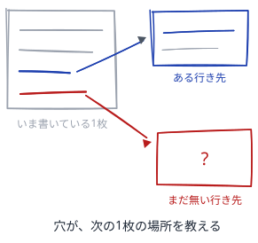
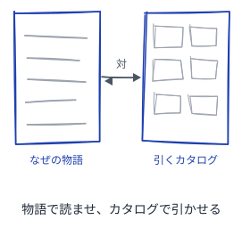

# スライドが育つパターン

発表して終わらない、育つスライドの作り方

---

## 読み方
<!--id:読み方-->
<!--agenda-->
書き手が手を動かす順に並べてある

### 削る: [原稿用紙](patterns-slidewiki.md#原稿用紙)
### 繋ぐ: [赤リンク](patterns-slidewiki.md#赤リンク)
### 組む: [上下巻](patterns-slidewiki.md#上下巻)
### 隣: [Wiki が育つパターン](patterns-wiki.md#読み方)
### 書き方: [パターンを書くパターン](patterns-meta.md#読み方)

---

## 原稿用紙
<!--id:原稿用紙-->
<!--pattern-->
### いつ・なにが困るか
言いたいことが多く、1枚の枠に収まらない。
文字を少し縮めれば、全部入るように見える。

**縮めて収めた1枚は、並ぶと1枚だけ声が小さい。**
読み手は小さい字を、弱い主張として受け取る。
詰め込んだ1枚は、どのみち一度には読めない。

### そこで
**枠のほうは動かさず、中身を削る。**
削って一文にならないなら [一枚一義](patterns-wiki.md#一枚一義) で割る。
収まらない1枚は、道具がビルドごと止める。

<!--source-->
名前は原稿用紙＝枠が先にあり、文章のほうを枠に合わせて練る。内容は PechaKucha 20x20（Klein & Dytham, 2003）＝20枚×20秒に固定し "talk less, show more" を強制する。「並ぶと1枚だけ声が小さい」はこのデッキの追加。

---

## 赤リンク
<!--id:赤リンク-->
<!--pattern-->
### いつ・なにが困るか
次の1枚を足すとき、先に行き先を書き上げたくなる。
無い行き先へのリンクは、壊れた印に見える。

**繋がりの発見が、書く作業の後ろに回る。**
何を書くべきかは、リンクの穴がいちばん知っている。
揃うのを待つ間に、その手がかりが消える。

### そこで
**無い行き先へ、先にリンクを書く。**
[未解決の一覧](guide.md#解決順) が、次に書く1枚の畑になる。
書き出す一文は [種ノート](patterns-wiki.md#種ノート) に従って置く。

<!--source-->
名前は Wikipedia の赤リンク。Spinellis & Louridas "The Collaborative Organization of Knowledge"（CACM, 2008）＝新しい記事の大半は、それを指す参照が書かれた直後に生まれる。元祖は c2 wiki（1995）の「?」リンク。

---

## 上下巻
<!--id:上下巻-->
<!--pattern-->
### いつ・なにが困るか
カタログのデッキに、背景や動機も足したくなる。
1本にまとまっているほうが、親切に思える。

**物語の混ざったカタログは、引くのに邪魔になる。**
引く人は答えが欲しく、読む人は筋が欲しい。
1本で両方に応えると、どちらにも半端になる。

### そこで
**なぜの物語と、引くカタログの、対の2冊に割る。**
割った2冊は [接ぎ木](patterns-wiki.md#接ぎ木) と同じで、必ず対で繋ぐ。
この並びの例が [第1部](intro-wiki.md#育てる理由) と [第2部](patterns-wiki.md#読み方) の組。

<!--source-->
名前は上下巻。内容は Alexander の2冊＝『時を超えた建設の道』（1979）が理論と物語、『パタン・ランゲージ』（1977）がカタログで、前者は後者の序説にあたる。カタログに序説を混ぜ込まず、対の別冊にして組で読ませる。
