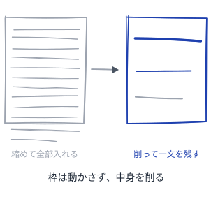

# スライドが育つパターン

発表して終わらない、育つスライドの作り方

---

## 読み方
<!--id:読み方-->
<!--agenda-->
書き手が手を動かす順に並べてある

### 削る: [原稿用紙](patterns-slidewiki.md#原稿用紙)
### 隣: [Wiki が育つパターン](patterns-wiki.md#読み方)
### 書き方: [パターンを書くパターン](patterns-meta.md#読み方)

---

## 原稿用紙
<!--id:原稿用紙-->
<!--pattern-->
### いつ・なにが困るか
言いたいことが多く、1枚の枠に収まらない。
文字を少し縮めれば、全部入るように見える。

**縮めて収めた1枚は、並ぶと1枚だけ声が小さい。**
読み手は小さい字を、弱い主張として受け取る。
詰め込んだ1枚は、どのみち一度には読めない。

### そこで
**枠のほうは動かさず、中身を削る。**
削って一文にならないなら [一枚一義](patterns-wiki.md#一枚一義) で割る。
収まらない1枚は、道具がビルドごと止める。

<!--source-->
名前は原稿用紙＝枠が先にあり、文章のほうを枠に合わせて練る。内容は PechaKucha 20x20（Klein & Dytham, 2003）＝20枚×20秒に固定し "talk less, show more" を強制する。「並ぶと1枚だけ声が小さい」はこのデッキの追加。
