# 部品の名前で引く

すでに市場にある名前を、LLM との差分で並べ直す

---

## 引き方-部品
<!--id:引き方-部品-->
<!--agenda-->
基準点は LLM。残りはすべて、LLM との差分で読む

### 基準: [[LLM]]
### 規則: [[ルールベースのプログラミング|ルールベース]]
### 予測: [[機械学習モデル]]
### 振る舞い: [[ファインチューニング]]
### 材料: [[RAG]] と [[LLM-Wiki|LLM Wiki]]
### 事実: [[データ基盤]]
### 口: [[MCP]]
### 段取り: [[ワークフロー]]
### 自律: [[AI-エージェント|AI エージェント]] と [[マルチエージェント]]
### 囲い: [[ガードレール]] と [[Evals]]
### 背景: [[intro-solutions/部品|第1部 なぜ差分で書くか]]
### 別版: [[patterns-delegation/引き方|同じ話を比喩の名前で]]

---

## LLM
<!--id:LLM-->
<!--pattern-->
### いつ・なにが困るか
「これ、LLM でできますか」に、いつも答えが割れる。
できると言う人と、できないと言う人が同じ物を見ている。

**LLM は、言葉を言葉に変える一往復の関数である。**
呼び出しをまたいで覚えず、外の世界に手も伸ばさない。
同じ入力に同じ出力も返さず、数も数えない。

### そこで
**足りないものを、名前の付いた部品で足す。**
足りないのは、記憶・手・段取り・同じ答え・数の勘の5つ。
以降の12枚は、すべてこの5つのどれかへの答えである。

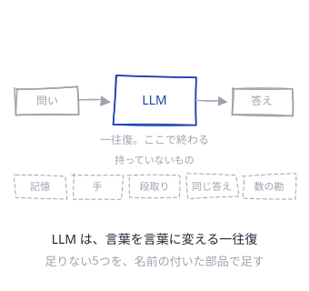

<!--source-->
LLM は推論のエンジンで、エージェントはその周りに組まれた系（記憶・道具・段取り・権限・実行時の状態）だという整理が2026年時点で広く共有されている。「LLM は問いに答え、エージェントは仕事を終わらせる」。

---

## ルールベースのプログラミング
<!--id:ルールベースのプログラミング-->
<!--pattern-->
### いつ・なにが困るか
条件で決まる判定を、プロンプトに書いて LLM に読ませる。
書き換えが速いので、仕様が文章のまま積み上がっていく。

**同じ入力に同じ出力が返る保証は、LLM には無い。**
通ったのが規則のおかげか、運かも区別できない。
料金は呼ぶたびにかかり、監査では経路を示せない。

### そこで
**決まる所はコードで書き、LLM には手前を渡す。**
LLM が担うのは、規則に載せる前の言葉の解釈だけになる。
足すのは**同じ答え**。取り上げるのは判定そのもの。

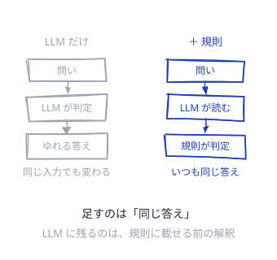

<!--source-->
Anthropic "Building Effective Agents"＝まず最も単純な解を探し、必要なときだけ複雑さを足す（エージェント的なシステムを作らない選択肢を含む）。2026年の実務では「既定はワークフロー、エージェントは複雑さを正当化してから」という言い方で共有されている。

---

## 機械学習モデル
<!--id:機械学習モデル-->
<!--pattern-->
### いつ・なにが困るか
解約しそうな顧客の予測も、LLM に文章で聞いている。
窓口が一つで済むほうが、作りも運用も楽に見える。

**LLM は数を数えず、確率も較正されていない。**
「たぶん高い」と返るが、その 0.8 に意味は無い。
一件あたりの費用は百倍、返る速さも桁で違う。

### そこで
**表に並ぶ予測は、事例で学習したモデルに渡す。**
LLM は入口と出口 — 問いの言い換えと説明に回る。
足すのは**数の勘**。取り上げるのは予測そのもの。

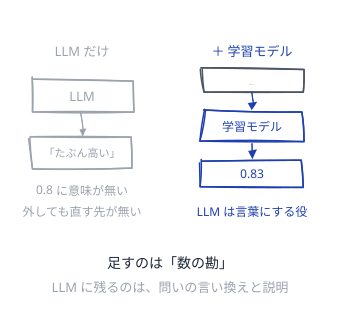

<!--source-->
構造化データの予測では従来型 ML が精度・遅延・費用・説明可能性で LLM を上回る。1リクエストあたり約100〜1000倍の費用差があり、従来モデルは CPU 上で 5ms 以下に返る。LLM の推論は最適化しても1秒前後かかる。

---

## ファインチューニング
<!--id:ファインチューニング-->
<!--pattern-->
### いつ・なにが困るか
社内の知識を覚えさせようとして、追加学習を検討する。
覚え込ませたほうが、毎回渡すより速く安く思える。

**重みに焼いた事実は、変わった日から嘘になる。**
どこを覚えたのかは外から見えず、消すこともできない。
一般の能力まで削れて、他の仕事が下手になることもある。

### そこで
**事実ではなく、振る舞いのほうを固定する。**
出力の形式・語彙・断り方と、小さいモデルへの蒸留。
足すのは**決まった振る舞い**。事実は [[RAG]] に渡す。

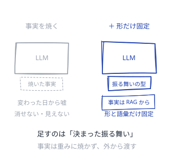

<!--source-->
2026年の整理では「ファインチューニングは形であって事実ではない」＝振る舞い・文体・構造化出力・拒否の型を変えるもので、知識を入れる手段ではない。事実の想起は RAG が一貫して上回り、重みに焼くと古くなるうえ検証もできない。最も商用価値が高い使い方は、大きなモデルを小さなモデルへ蒸留して推論費用を一桁下げること。

---

## RAG
<!--id:RAG-->
<!--pattern-->
### いつ・なにが困るか
社内の事情を知らないまま、それらしい答えが返ってくる。
プロンプトに全部貼ると、料金と待ち時間が跳ね上がる。

**LLM は、渡していないものを知らない。**
知らない所を黙って埋めるので、見分けが付かない。
長文脈に全部載せる方式は、規模が出ると20倍を超える。

### そこで
**問いのたびに、要る分だけ取ってきて渡す。**
LLM は取ってきた文章を読み、答えの形にする。
足すのは**その場の記憶**。棚の中身は [[LLM-Wiki|LLM Wiki]]。

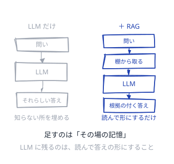

<!--source-->
長文脈にすべて載せる方式は規模が出ると RAG の20〜24倍の費用になり、更新の速いデータでは RAG が最大9割安いという報告がある。2026年は「一回だけ取ってくる」古典的 RAG と、エージェントが取り方を決める agentic RAG が使い分けられ、単純な事実照会には前者が効率的とされる。

---

## LLM Wiki
<!--id:LLM-Wiki-->
<!--pattern-->
### いつ・なにが困るか
[[RAG]] を用意したが、棚に入れる文章が社内に無い。
手順も判断の理由も、人の頭と会話の中にだけある。

**取りに行く先が空なら、検索の精度は関係ない。**
人向けに書かれた資料は、機械には拾えない形をしている。
拾えなかったぶんを、LLM は言葉で埋めてしまう。

### そこで
**AI が読む前提で、前提のほうを書き出す。**
索引と見出しを付け、語彙を寄せて、辿れる形に置き直す。
足すのは**組織の前提**。育て方は [[intro-llm-wiki/任せる理由|司書の話]]。

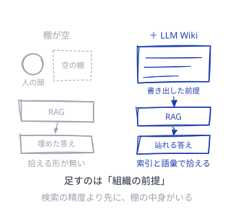

<!--source-->
2026年のエージェント向け資料は、llms.txt（何がどこにあるかの索引）と AGENTS.md（振る舞いと手順の指示）を軸に標準化が進んだ。索引を読ませて必要な文書だけ取りに行かせる形で、埋め込み検索に頼らず辿れるようにする。AGENTS.md は 2026-02 に MCP と並んで Agentic AI Foundation へ寄贈された。

---

## データ基盤
<!--id:データ基盤-->
<!--pattern-->
### いつ・なにが困るか
「先月いくら減ったか」に、それらしい数字が返る。
文章の中の数字を拾っているので、合っている時もある。

**LLM は数えない。読んだ数字を並べ替えるだけである。**
出来事が残っていなければ、そもそも数えようがない。
残っていても、指標の定義が三通りあれば三通り返る。

### そこで
**出来事を残し、指標の意味を一箇所で決めておく。**
LLM は何を数えるかを選び、数えるのは基盤が担う。
足すのは**数えられる事実**。呼び出し口は [[MCP]]。

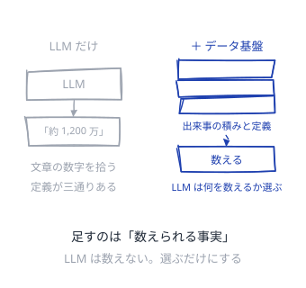

<!--source-->
2026年は、生の表をそのまま渡すのではなく、意味の層（semantic layer）で指標と語彙を定義してからエージェントに触らせる形が「agent-ready data」として整理された。MIT の調査（役員面談52件・調査153名・公開事例300件）では、生成 AI の試行の95%が損益への計測可能な影響を出せていない。

---

## MCP
<!--id:MCP-->
<!--pattern-->
### いつ・なにが困るか
道具を繋ぐたび、モデルごとの配線を手で書いている。
相手が増えるほど、配線は掛け算で増えていく。

**LLM 自身は、外の世界に触れない。**
触れるのは、外から与えられた道具の口だけである。
専用の配線は作った人しか直せず、記録もばらばら。

### そこで
**道具の口を、共通の規格で名乗らせる。**
LLM は口の説明を読み、どれを呼ぶかだけを決める。
足すのは**手**。開けた口には鍵と記録を付ける。

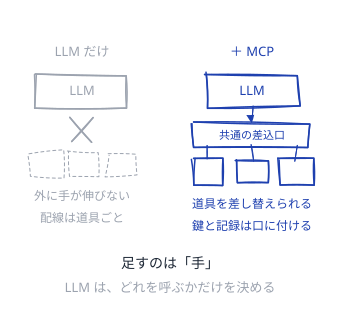

<!--source-->
MCP は 2024-11 に Anthropic が公開し、2025-12 に Linux Foundation 傘下の Agentic AI Foundation へ寄贈されて単一ベンダの製品判断から離れた。2026年時点で公開サーバ 9,400 件超、月間 SDK ダウンロード 9,700 万。2025-11 の仕様更新で非同期処理・サーバの本人確認・監査証跡が入り、2026年の優先課題は水平スケールと SSO・ゲートウェイ。

---

## ワークフロー
<!--id:ワークフロー-->
<!--pattern-->
### いつ・なにが困るか
手順の決まった仕事を、[[AI-エージェント|エージェント]] に丸ごと任せている。
途中で落ちると、どこまで進んだか分からなくなる。

**LLM の呼び出しには、途中も再開も無い。**
順番が事前に描けるのに、毎回ちがう順で動いてしまう。
落ちた時に何が二重に実行されたのかも、後から追えない。

### そこで
**順番はコードで書き、LLM の呼び出しを部品として挟む。**
一歩ごとに記録が残るので、落ちた所から再開できる。
足すのは**段取りと再開**。描けない一歩だけ [[AI-エージェント|エージェント]] に。

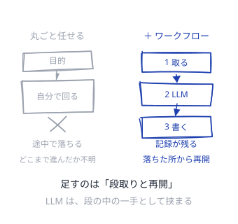

<!--source-->
Temporal / LangGraph の durable execution は、段取りを決定的な関数として書き、LLM 呼び出し・API・ファイル書き込みを「活動」として外に出す。履歴を残して決定的に再生することで、落ちた所から再開でき、活動の完了を一度きりにできる。人の承認を挟む長時間の仕事で効く。

---

## AI エージェント
<!--id:AI-エージェント-->
<!--pattern-->
### いつ・なにが困るか
道順が描けず、[[ワークフロー]] を書き下せない仕事がある。
かといって人が一手ずつ指示すると、任せた意味が無い。

**LLM は一往復で終わり、自分では次を呼ばない。**
道具を呼び、結果を読み、また考える輪が要る。
輪を回すほど、一歩ずつの失敗が掛け算で効いてくる。

### そこで
**目的と道具を渡し、手順のほうは相手に決めさせる。**
LLM は輪の中の一手を担い、輪そのものは外側の系が回す。
足すのは**手とループ**。囲いは [[ガードレール]]。

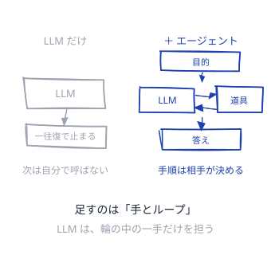

<!--source-->
エージェントとは、一つ以上のモデルを道具・記憶・段取り・権限・実行時状態で包み、多段の仕事を実行する系。一歩あたり 95% でも 20 歩つなぐと全体は 0.95^20 ≒ 36%（誤りは相関するので実際はこれより悪い）。METR は「50% の確率でやり切れる仕事の長さ」がおよそ7か月で倍化していると報告している。

---

## マルチエージェント
<!--id:マルチエージェント-->
<!--pattern-->
### いつ・なにが困るか
一人分の文脈に材料が入りきらず、古い話から消える。
役割を分けて並べると、人の組織のように賢く見える。

**分けた瞬間、渡し損ねた文脈が失敗の主因になる。**
費用は一往復の十数倍。実行記録の失敗率は4割から9割近い。
受け渡しが輪になって終わらない、という壊れ方もある。

### そこで
**入りきらず、探す道が独立している時だけ分ける。**
一人が段取りを持ち、残りは別の文脈で並列に探す。
足すのは**並列と別の文脈**。継ぎ目の検査は [[ガードレール]]。

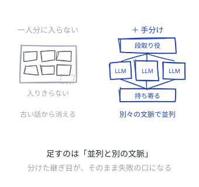

<!--source-->
Anthropic の研究用マルチエージェント（Opus 4 が Sonnet 4 の部下を指揮）は単体を 90.2% 上回った一方、消費トークンは通常の対話の約15倍。UC Berkeley が7つのフレームワークの実行記録 1,642 件を解析した MAST では失敗率 41〜86.7%。本番で最初に選ばれるのは orchestrator-worker 型で、責任の所在・追跡可能性・費用の予測がつくため。

---

## ガードレール
<!--id:ガードレール-->
<!--pattern-->
### いつ・なにが困るか
出す前に人が全部見るのは、量が増えると続かない。
プロンプトで「こう書くな」と頼むが、たまに破られる。

**頼みごとは規則ではない。LLM は必ずしも従わない。**
形式の崩れた出力は、下流のコードをそのまま落とす。
個人情報や社外秘は、出てしまってからでは戻せない。

### そこで
**出入り口に、機械が合否を出す検査を置く。**
形式・個人情報・禁止語は、決定的に弾けるので頼まない。
足すのは**実行時の合否**。事前の測りは [[Evals]]。

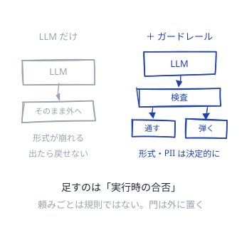

<!--source-->
2026年は「evals は配布前の回帰試験、ガードレールは実行時に一件ずつ通す門」という二層で整理された。ガードレールは要求の経路に入ってミリ秒で判定し、緩すぎれば有害な出力が通り、厳しすぎれば正当な要求が落ちる。検証器は積み重ねられる（個人情報検出・毒性判定・形式検査など）。

---

## Evals
<!--id:Evals-->
<!--pattern-->
### いつ・なにが困るか
直すたびに、触った人の感想で良し悪しを決めている。
直したい所は直るが、他が落ちたかは誰も見ていない。

**LLM の出来は、変えるたびに別の所が動く。**
感想では、良くなったのか慣れたのかを区別できない。
本番で何が起きたのかも、記録が無ければ後から追えない。

### そこで
**例題を並べ、変更のたびに採点し直す。**
機械で測れない所は、別の LLM を採点役にして揃える。
足すのは**変化の測定**。実行時の門は [[ガードレール]]。

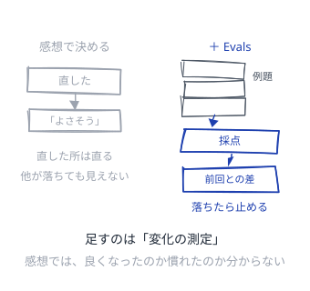

<!--source-->
2026年の実務は、離散的な一歩ごとの単体 eval、主観的な質のための LLM-as-judge 回帰試験、本番トレースの継続的な標本抽出の3つを組む。オフラインの eval は回帰試験として働き、閾値を割った変更は配布前に止める。トレースはプロンプト・道具呼び出し・検索・トークン・遅延・費用を残し、あとから再生できるようにする。
